

# 2020/10/11

* 100Mのデータを処理するのは難しい
  * user_idを10で割ったあまりで、10個のデータに分ける→10個のモデルを作るってのはどうだろう?
  

# 2020/10/12
* mlflowを導入
* target_encoding, intelligence_scoreの導入
  * intelligence_score: 問題毎に正解率の逆数を付与(難しいほど高い)
* とりあえずsubmissionスクリプト書いて回してみたけど…通るだろうか…

# 2020/10/13
* pickle -> featherで試してみる
* floatの不要な特徴は全部削除
* target encodingとかの特徴作成に時間かかってる。loadingはfeatherにしたことで解消した。

* 結局、partial_fitをすることで解消(PartialAggregator, ex005_pipeline)

# 2020/10/14
* exp005のモデル提出 CV:0.757(10fold-mean), LB: 0.743
* exp006: groupbyの項目を増やして試す
  * 全面的にクラス設計を見なおした
* exp007: 全データの1%のユーザーの行は全部validationに -> CVそんな変わらず

# 2020/10/15
* exp006の1モデル　CV:0.760 LB: 0.739
* exp008: CV: 0.761
  * trainはsplitだけとtestは全部マージしていることによるバグ修正
    * user_id削除
    * countencodingはuser_id以外は10倍にする
  * 項目増やす
* exp009 => CV:0.751
  * question, lectureの追加
  * answered_correctly=-1(lecture)も訓練してたバグ修正
* exp010 => parameter tuning. iteration少ない方が良さそう
  * lr=0.3にしてあといろいろ

# 2020/10/16
* exp009のpredict改良、fitは毎回やらない(10000件ごとに実施)
* exp011: 10model lr=0.3 => CV:0.754 LB:0.747
* exp012: 1model/50Mrow data
  * 固まって動かない。30Mrowでもダメ…辛い…
* exp013: tags1~tags6の特徴追加
  * tags1~tags6はあんまり効果なさそう
  * 20M行にして夜放置してみる

# 2020/10/17
## experiment
* exp013: CV: 0.756(10modelと比べて+0.005) LB: 0.742
* exp013-2: exp013はsplit_numミスってたので、それの修正 これとexp011-2どっちがいいか？
* exp014: 3model(30Mrow) => CV 0.757(1model, 2300epoch)途中で終わり
* exp011-2: exp013と同じモデルで、fitの頻度を10000=>300に変更: LB 0.750
* exp015: TargetEncoding with initial weight
  * user_idとtimestampでソートするよう修正。。
* exp016: TargetEncoding with initial weight + user_ability
##  EDA
  * tags 003_tags_vs_targetencoder
    * 
    * まあ、tags1~6のcountencodingで十分カバーできてるかなぁ…
  * user_id 004_user_id_answered_correctly
    * 成績悪い人、成績いい人を比較する
      * 成績悪い人はlecture受けてる件数が多い
        * 
      * いい人はlecture受けてる件数が少ない
        * 
  * user_level
    * 頭が良ければ正解率高いとは限らん。その人にあった問題を選んで勉強するはず。そのレベルを見る。
      * 
      * 
    * target_encoding, 初期値ブレがち。200件*0.655を最初から加重しとくのがよさそう！ -> exp015
      * 

# 2020/10/18
## experiment
* exp015: TargetEncoding with initial weight => CV: 0.752(1model) +0.002 from exp011 -> LB: 0.732(!?)
  * user_idとtimestampでソートするよう修正。
* exp016: TargetEncoding with initial weight + user_ability => CV: 0.756) +0.006 from exp011 -> LB: 0.666(!?!?)
* exp017: initial_score, initial_weight設定忘れてる...
  * あと、なんかexp015, exp016がuser_idとcontent_idの順番逆なのになぜか動いていたっぽい。けど今は動かない。
  * スコアが低いのもそこらへんでなんかバグってるのが要因では。。
* exp018: exp011を20model -> LB: 0.750
* exp019: exp011 + nunique, shiftdiff
## EDA
* 006_previous_X
  * questionに絞ると、前のquestionと今のquestionが一緒の場合、正解率は高い(当たり前か!?)
  * 
  * timestamp_diffみると、1000~10000は正解率低い
  * 

# 2020/10/19
* exp019 -> CV: 0.764 / LB: 0.751
* exp020: exp011を丸コピ(exp019が上がりすぎてるので怪しい。。) -> CV戻った
* exp021: user_levelのみ + exp019 (sort_valueなし) -> CV: 0.769 / LB: 0.711 :(
* exp022: exp021 + lecture.csvなし
* exp023: exp021 + type_of, tag 使う

# 2020/10/20
* predictionの特徴作成本当にあってるか、確認するスクリプト作成 ok
* exp023: target_encoderがリークしてた…のか。
  * is_partial_fit：未来のデータで過去のデータをencodeしている
* exp024: environmentちゃんと動いてるか確認(CVとかは見ない) exp021でやる
* exp021_2: exp021 + partial_predict_mode変更

# 2020/10/21
## EDA
* 007_shiftdiff
  * 

## experiment
* exp019_2: shiftdiffをリアルタイムに -> LB: 0.756!

# 2020/10/22
## experiment
* exp025: user_levelとnuniqueを削って、content_id系だけ早く更新する -> CV: 0.723?
  * バグってるので要確認
* exp026: ("user_id", "content_id")を加える
* exp027: parameter tuning 旅行中

# 2020/10/23
## experiment
* exp025-2: update_record=50

# 2020/10/25
## experiment
* exp028 parameter tuning結果の反映(base: exp019)

# 2020/10/26
## EDA
* answerの精度が低い人、user_answerが0, 3に固まりがち

* そもそも、answer=2が少ない…

# 2020/10/27
## experiment
* exp029: 各target_encをuser_idのtarget_encとぶつける -> CVかわらず

# 2020/10/28
## experiment
* exp030: user_levelに再トライ -> 1modelのみでいったんsub
* exp031: counter(その時点までに何回該当カテゴリを通っているか?)

# 2020/10/29
* exp032: user_levelだけにしてpartial_predictとall_predict比較
-> 
-> LB: 0.766!
* そのまま、exp031と同条件で、partial vs all での精度を比較

# 2020/10/30
## EDA
* 過去にこのユーザーが同じquestionを解いたか

## experiment
* exp033: exp031 + 1個前の解答 (とりあえず生コードで）-> CV: 0.772
* だけどメモリーエラー…

# 2020/10/31
## experiment
* exp034: shiftdiff(content_id)! (直近が同じか?) -> あんまり変わらず
* exp035: exp030と同じ特徴量、CountEncoderのバグ修正したやつ
* exp036
  * content_type_idのtarget_encodingは不要
  * partはtarget_encoding, level必要
  * {prior_question_had_explanation, correct_answer}
  * {prior_question_had_explanation, part}
* exp037
  * tag全部もり(subは流石に無理そうなので無し)
## EDA
* 011_user_answer
  * correct_answerのバランス悪いのなんでだろう
    * 
  * exp036に、{prior_question_had_explanation, correct_answer}を加える

* 012_prior_question
  * partとぶつける
    * 
  * exp036に、{prior_question_had_explanation, part}を加える

* 013_bundle_id
  * 特になし。。

* 014_part
  * part vs 時間diffで相関あるか？ -> part7は結構顕著に出てる
    * 
    * exp036に、groupby("part")["time"].mean()
  * partごとのtarget平均
    * 
  * user_id/partごとの正解率相関
    * 
    * 

# 2020/11/1
## experiment
* ex_036: CV: 0.771 LB: 0.775!!
* ex_038
  * max_bin=1024 -> そんなに変わらない
  * feature_fraction=0.1
* ex_037(tag全部もり) -> あんまりスコア変わらない
* ex_039
  * count_bin追加, partごと/count_binごとのCategoryLevelEncoder
  * diff_rate_mean_target_enc_part_1が強い。part1なんか大事そう
* ex_040
  * prior_question+user_count_bin, content_id+prior_question_had_explanation
  * part+prior_question_elapsed_time_bin

## eda
* 016_user_id
  * 
  * prior_question_had_explanationは、最初のほうが顕著に正解率下がる
    * 
* 017_prior_question_elapsed_time
  * partごとに、かけた時間と正解率が違う。確かに、文法なんかはわかったら一瞬

# 2020/11/2
## experiment
* ex_039はtimeup
  * CategoryLevelEncoderが時間食ってる(あたりまえ)
* ex_041 -> CV: 0.771 / LB: 0.777
  * CategoryLevel: part=(2, 5), bin=(0)
  * pickle化も同時にやる
* ex_042 -> model1: CV0.768をみて撤退
  * base_ex041
  * LevelEncoder系、全部[content_id, prior_question_had_explanation]にする
* ex_043 ->
  * base_ex_041
  * PriorQuestionElapsedTimeDiv10Encoder -> ほとんどfeatureimporance0

## EDA
* 018_prior_question_time
  * 10で割ったら…
  * 

# 2020/11/3
## experiment
* ex_046: hyperparam tuning

# 2020/11/4
## experiment
* ex_047: parameter tuned & lr=0.1 -> CV+0.001だがLBあまりかわらず
* ex_048: previous_answer(reduce memory)
* ex_049: reduce features => CV: 0.776 / LB: 0.784(freq=30)

# 2020/11/6
## experiment
* ex_050: nnを試す
* ex_051: minimam_nn(64-32-1) => CV: 0.755

# 2020/11/7
## experiment
* ex_048_3: 再度試す(速度改善ver)

## EDA
* ex_052:
  * PreviousAnswerにindexつける! (ex_048とコード自体はかわらない) => CV: 0.777(only model-0)
* 020_previous_xxx
  * part / content_id
    * 
  * shift1_contentid: 正解したのにもう1回やってる人いる。単純に間違えただけでは? => ex_052: previous_answer3
    * 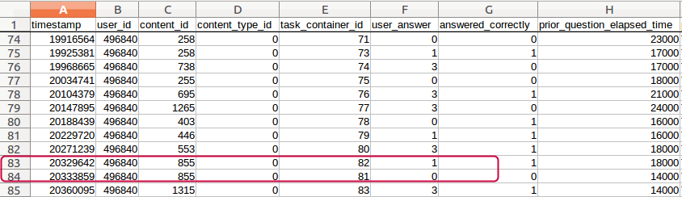
  * shift2_contentid: 間違えた! -> 教材見て -> もう1度復習　…これ、頑張ればquestionとlectureひも付けられそう
    * 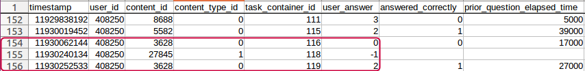
  * shift3_contentid: shift2とおなじ(ちょっとタイムラグあるだけ)
    * 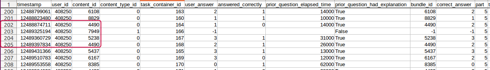
* 021_lecture-question
  * shift2_contentidで見つけたquestionとlectureをひも付けて、lectureを受けた人・受けてない人での正解率探す -> やっぱり受けた人のほうが正解率高い
    * 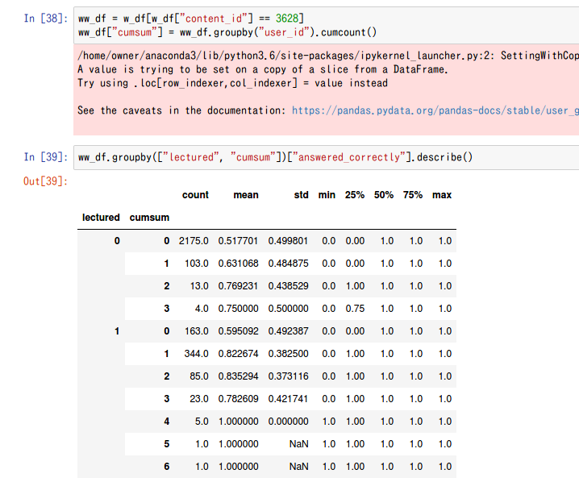

# 2020/11/8
## experiment
* ex_053: question_lecture_map
* ex_052_2: previous_answerのバグ直して再提出 -> LB: 0.780(down...)
* ex_054: catboost(feature: ex_052) depth tuning

# 2020/11/9
## experiment
* ex_052_2: indexリアルタイム更新にして再度提出 -> LB: 0.780...
* ex_055_0: PreviousAnswer、indexあり版でindex消すとCV0.770, indexなし版CV0.773
  * なぜ？データ確認する -> user_idのみでgroupbyしてたので、単純に「前の問題に正解してるか」になってた
* ex_055_0_1: answer_idxもバグ確認
* ex_055: indexなしで1回subする(=exp048)
  * 原因がindexなのかanswerなのかで切り分けたい+スコア更新したい
* ex_056: ex_055+cat&lgbm
* ex_057: ex_056+index
  * lgbm CV: 0.779 -> LB: 0.786
  * cat CV: 0.780 -> LB: 0.783
  * lgbm+cat CV: 0.781(たぶん)

# 2020/11/10
## eda
* 022_previous_content
  * previous_content_type_id 1個前がlectureのときのほうが正解率高い -> 特徴に追加
    * 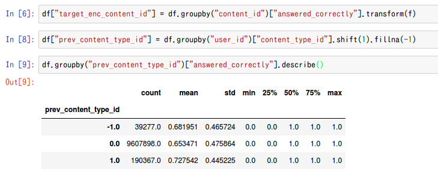
  * 更に見ていくと, content_type_id=[1, 0]の順番でのconunt_encoderで、数が多いほど正解率が高い。コレは使えそう
    * 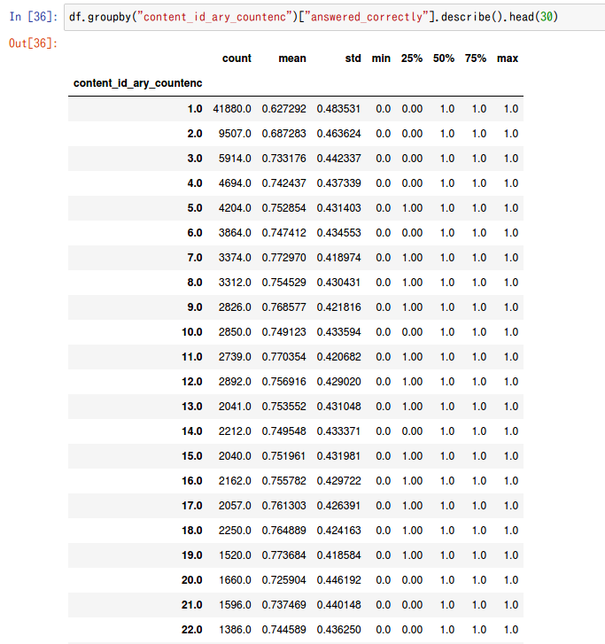

# 2020/11/11
## experiment
* ex_059: depth tuning
* ex_060: ex_057+previous_lecture -> CV: 0.7770(変化なし?)
* ex_061: ex_060+initial_weight/initial_score -> CV: 0.777(ex_060とあんま変わらず)
* ex_062: ex_057+content_level_encoder -> CV: 0.7778(first model)
* ex_057とex_049でuser_rate系の値が違う
  * df.sum(), df.values.sum()、後者はnp.nanがあるとsumもnanになるよ！
  * ex_057_2.pyでfeature_factory_manager作り直し

# 2020/11/12
## experiment
* ex_063: ex_062 + groupby(user_id).mean(content_level)
  * TODO: groupby(content_id).mean(user_id)もしたいけど、ライブラリの制約でできねぇ…改造するか
* ex_064: ex_063のdf_train->fit vs all_predict
  * データの順番変えたらそりゃ結果かわるよね -> データの順番も完全一致させる？ -> いや、そこはあわせてたっぽい

# 2020/11/13
## experiment
* ex_066: ex_057 + bugfix -> CV: 0.7773(model1) LB: 0.786
* ex_067: target_enc_content_idをuser_idなどでdiffとりまくる(userにとって簡単かどうか?) -> CV: 0.7780(model1)
* ex_068: ex_067 + FirstPart, FirstContentId -> CV: 0.7782(model1)
* ex_069: ex_068 + First1~5Ans -> CV: 0.7780(model1) down...
* ex_070: ex_068 + user情報からcontentの難しさを測るという発想なら、逆もありでは?
  * target_enc_user_idをcontent情報系で -> 0.7782(model1)
* ex_072: ex_070 + map
* ex_072_0: map作り直し(threshold=300->50)

## EDA
* 023_first_X_answered_correctly -> 特徴に加えてみる
  * 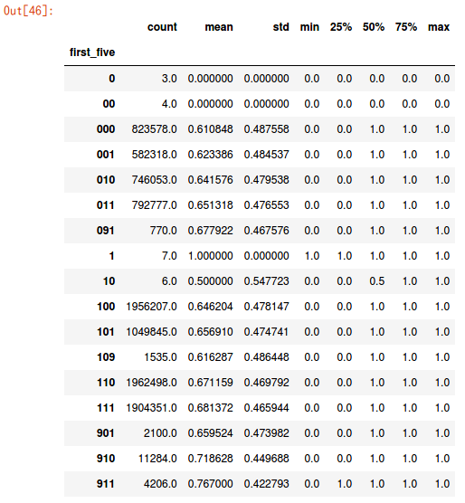
* 024_first_XXX
  * TOEICの目標点によって変わるのでは?
    * content_id=7900が圧倒的に多いっぽい
      * 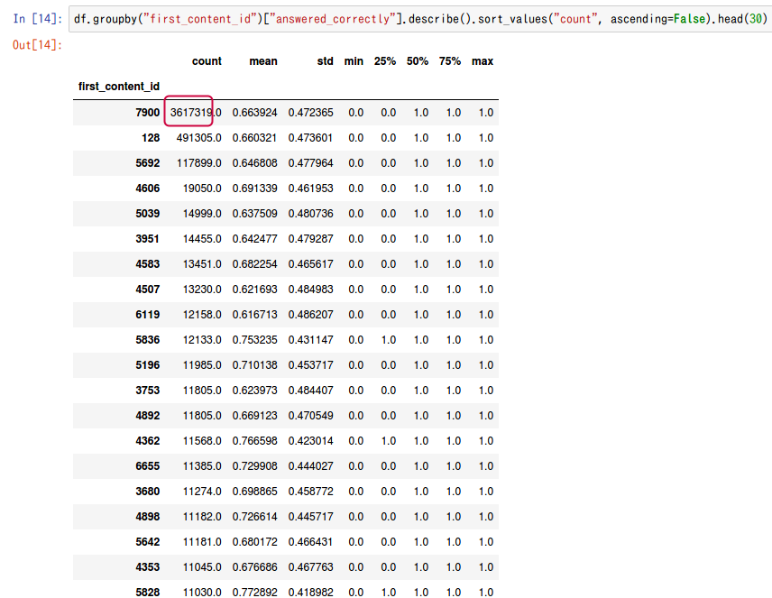
    * part: 5が多いっぽい。ただcontent_id=7900はpart=1だけどね。。
      * 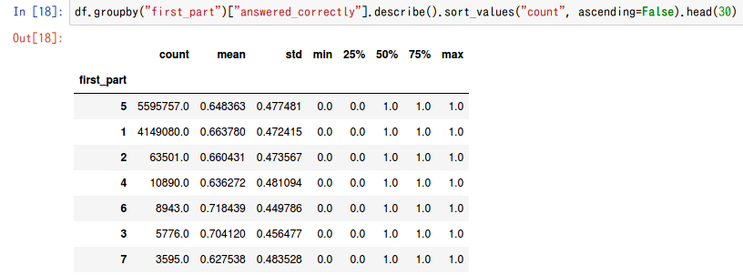

# 2020/11/14
## experiment
* ex_073: countencoderを全部抜く -> CV: 0.7779(model0) LB: 0.786
* ex_074: PreviousAnswer, 500問以上前はnp.nan! (ex_073と内容一緒) model1 only CV: 0.7772(-0.0007)
* ex_075: ex_066を20Mrow-10model
* ex_076: ex_074 + session加える, shiftdiffを消す(※SessionEncoderはall_predictしか書いてない) CV: 0.7785
* ex_077: ex_077 + previous3answer CV: 0.7785 (+ 0.0006)
* ex_078: ex_074 + intention_count, target_enc_content_id_mean

## EDA
* 025_session: 学習セッション
  * sessionごとの正解率：最初が低い。。けどこれはすでに捉えてそう
    * 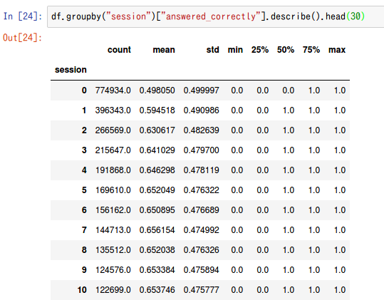
  * sessionごとに今何問目？の正解率
    * 0~30は低いが、30~で多くなってる。。まあこれも捉えてるんかなぁ…(一番最初のsession影響?)
    * あと0は極端に低いな
      * 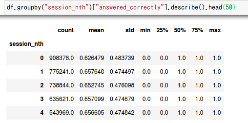
      * 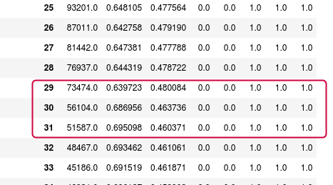
* 026_prev_n_answer_correctly:
  * あんまりuser_idとの相関もないし、結構効きそうだぞコレは!ただ、fitがリアルタイムじゃないからリークしてるかもなぁ
    * 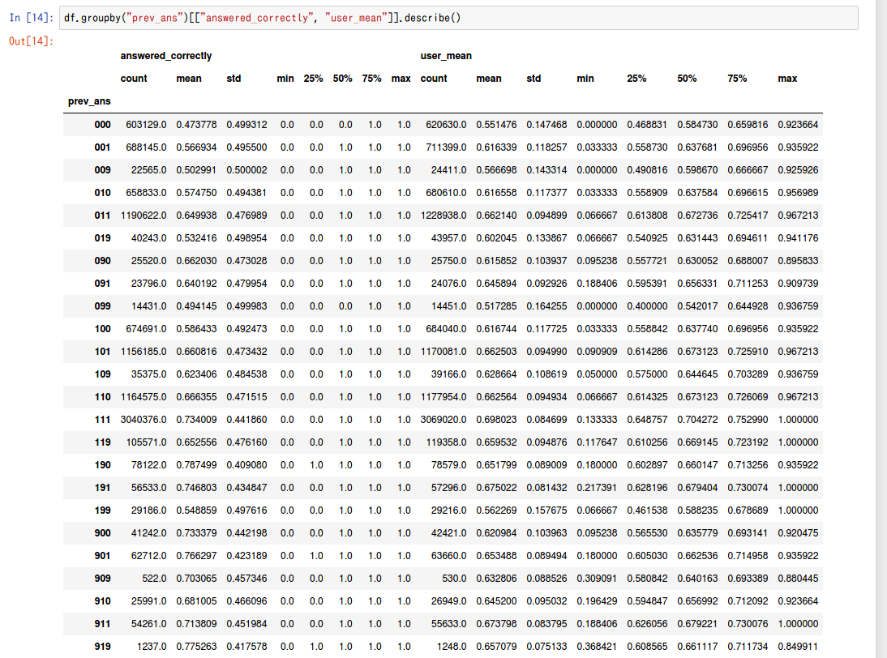

## other
* GCP instance -> あきらめ…
  * https://qiita.com/inumaru9n/items/e8250af967431c46ad45

# 2020/11/15
## experiment
* ex_078: Counter(intention), TargetEncAggわちゃわち -> 0.7782
* ex_079: 特徴カット(ex_074 base) -> 0.77719
* ex_080: ql_map -> 0.77910
* ex_081: ex_076-ex_080をあわせた -> 0.77938
* ex_082: ex_081のTargetEncをcontent_idにしぼりこみ -> 0.77938(いっしょ)
* ex_083: Session抜く -> 0.77887
* ex_084: Session抜いてとりあえず10model -> CV: 0.7786(model1) LB: 0.782 (-0.004)
* ex_085: ex_084の20Mrow version

## EDA
* 027_lecture_typeof
  * intentionはちょっと効くかな?って感じ
  * 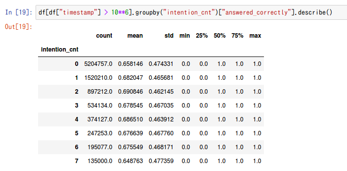

## other
* performance tuning.
  * fit
      * ContentLevelEncoder 90ms -> 50ms
      * CategoryLevelEncoder 70+80ms -> 10+10ms

# 2020/11/16
## experiment
* ex_086: te_content - (te_user系), te_user - (te_content系) -> CV: 0.7779

# 2020/11/17
## experiment
* ex_088: bug check
  * te_xxx: df.values.mean とかにしてた. numpyはnullが１個でもあるとだめだよ
  * previousNanswer: なんかバグってる -> partial_predictが更新ありの場合、is_partial_fit=Trueだと２回更新されちゃう
* ex_084をもう一度(CVのみ) -> CV: 0.7785(model1, -0.0001)
* ex_089: QLtable2
  * 精度変わらず
    * QLtableは0-1の引き算, QLtable2は生値？ -> QLtable2を引き算に変更
    * よくみたら単純にバグってただけ…
    * QLtable diff -> model1 CV: 0.7798(100epoch)-0.7805(200epoch)
    * QLtable normal -> model1 CV: 0.7832(100epoch)-0.7841(200epoch)
* ex_084: もう一度, fitだけしてサブする
* ex_090: ex_089を20Mrow(GCP) -> CV: 0.7873(model0+1)
* ex_091: ex_089 + 昔消した特徴たち

## other
* 処理の並列化
  * https://qiita.com/uo_ta/items/8d265a0f03300ebc2635

# 2020/11/18
## EDA
* 028_user_answer_and_content_id
  * 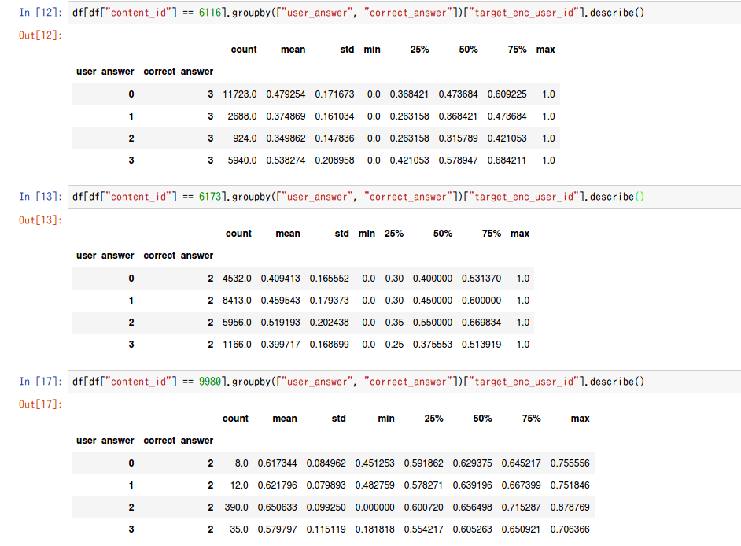

# 2020/11/19
## other
GCP上でアップロード:  
kaggle datasets init -p riiid_code/
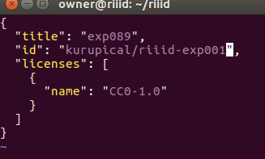
kaggle datasets version -p riiid_code/ --dir-mode "zip" -m "test"

# 2020/11/20
## experiment
* ex_094: 50M rows

# 2020/11/21
## experiment
* ex_089(finalize): CV. 0.7830(model0)
* ex_095: ex_089 + qq_table CV: 0.7836
  * 空欄が目立つ…もうちょいデータとっても良さそう
  * 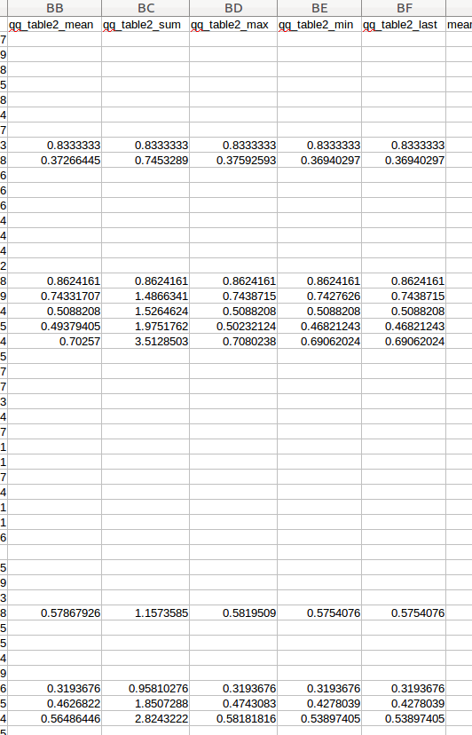
* ex_096: ex_089 + useranswer_table CV: 0.7837
* ex_097: ex_089 + weighted_te CV: 0.78366
* ex_098: ex_089 + qq_table(min_size=500?) 元気があれば CV: 0.7836
* ex_099: 全部のせ　CV: 0.7843(model0) -> CV: 0.7843

# 2020/11/22
## experiment
* ex_100: ex_100 + user_content_rate -> CV: 0.7852 (+0.0009)
* ex_101: ql_tableは条件厳し目(min_size=1000) -> CV: 0.7830(-0.002)
* ex_102: lgbm update + ex_101
* ex_103: re-think data validation(10% all new user, 90%: train9:val1) -> CV: 0.7822(-0.0008)
* ex_104: ex_103 + Elo Rating -> CV: 0.7824(+0.0002)
* ex_105: ex_104 + Elo Rating(user_id, part) -> CV: 0.7827(+0.0003)
* ex_106: initial_rateを最初の問題にあわせる -> CV: 0.7825
* ex_107: ex_105 + Elo Rating(user_id, tags) -> CV: 0.7832
* ex_108: ex_107 - weightedte -> CV: 0.7833
* ex_109: ex_108 - te : CV: 0.7829
## EDA
* 030_prior_question_user_count -> prior_question_had_explanationでtarget encodeするの、情報を圧縮してる。
  * user_count_binでやるのが正しい
  * [image_41](image_41.png)
* 031_check_auc
  * TOTAL: 0.7821
  * user_count
    * <30: 0.7629 (n=148399)
    * >30: 0.7796 (n=1637174)
  * part -> part2, part5の精度が悪いっぽい
      * part=1, n=115860: auc=0.809
      * part=2, n=356685: auc=0.7552
      * part=3, n=150430: auc=0.8008
      * part=4, n=137949: auc=0.8173
      * part=5, n=775714: auc=0.76
      * part=6, n=181319: auc=0.7977
      * part=7, n=107240: auc=0.8192
  * part2(3択)
    * 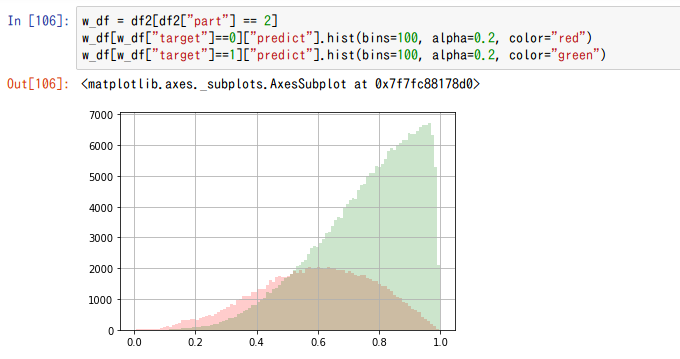
  * part5
    * 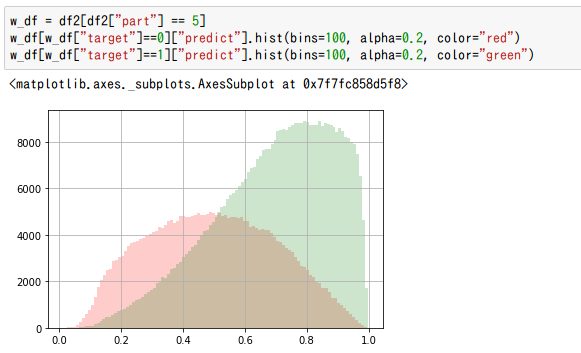

# 2020/11/23
## Experiment
* ex_111: user_answer/user_idを消す(重すぎる) -> CV: 0.7824
* ex_112: part5 only -> 0.7605
* ex_113: category(tags1, tags2, content_id) -> 0.7832
* ex_114: ex_113 + user_id(本番では使えないけど) -> 0.7832
* ex_115: tags6まで入れた -> 0.7832
* ex_116: Counterを入れた(content_type_id, part) -> 0.7832(変わらず)
* ex_117: (user_id, part).mean("prior_question_elapsed") -> 0.7833
* ex_118: study_time -> 0.7850
* ex_119: userlevelとかcontentlevelがバグってると思うので消す -> CV: 0.7846 -> LB: 0.792!!
* ex_120: lr=0.3 -> 0.1 & cat CV: (lgbm: 0.7866, cat0.7849, ensemble0.7876) -> lgbm LB: 0.793!!
  * ただしcatはcategorical feature指定なし。4時間/model の時間がかかるので…

## EDA
* 032_check_low_auc_tag\
  * 

  * 分布見てみると、「もう予想できませーん」っていってるようなもん
  * 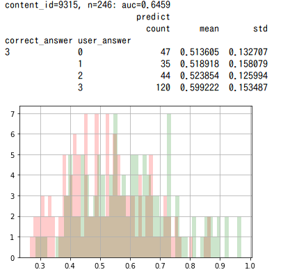

# 2020/11/24
## experiment
* ex_121: QQ_table/QL_table -> threshold=100にしてみる。overfitしたのは別の原因ではCategory Level Encoderとかが悪さしてそうだし…
-> CV: 0.7897 / LB: 0.793(へんかなし)

## EDA
* 036_w2v and swem

# 2020/11/25
## experiment
* ex_122: W2V
  * BaseLine(lr=0.3) -> CV: 0.7885
  * window10-size3: CV: 0.7884
  * window10-size5: CV: 0.7886
  * window10-size10:  CV 0.7884
  * window20-size3: 0.7886
  * window20-size5: 0.7887
  * window20-size10: 0.7884
  * window50-size3: 0.7883
  * window50-size5: 0.7886
  * window50-size10: 0.7883
* ex_123: TargetEncoding(tags1, tags2) -> CV: 0.7876
* ex_124: ex_123 + Counter + regression -> CV: 0.7877
* ex_125: ex_123 + Counter -> CV: 0.7877
* ex_126: listening-readingでわけてrating + tta -> CV: 0.78729 -> 0.78734
* ex_127: study time fix(shift: -1) -> CV: 0.7937(+0.006) だけどこれはリークだよね
  * でも、elapsed_timeがわかると強いってことはわかった
* ex_128: ElapsedTimeVsShiftDiffEncoder -> CV: 0.7880
* ex_129: ShiftDiff replace(0 -> bfill)になおした(bundle_id対応) -> CV: 0.7889
* ex_130: prior_question_elapsed_timeよりも、shiftdiff_timeのmeanのほうが効きそう -> CV: 0.7889
  * ただし、>200000は消す処理入れたやつにする、study_timeとかも全部
* ex_131: shiftdiff_time だけじゃなくて、prior_question_elapsed_timeにしとく -> CV: 0.7890
* ex_132: ex_131 + top40 features CV: 0.7886
## survey
* DSB2019
  * 1st
    * statistics: last N hour features.
    * event interval features / Density
      * 過去何日でpart/tagをやった日数
      * 一番最後のpart/tag timestamp, index
    * video skip prop ratio
      * Counter(prior_question_had_explanation)
    * data augmentation??
  * 2nd
    * Decayed Historical feature.
  * 7th
    * On the Measure of Intelligence https://arxiv.org/abs/1911.01547
    * learning tempo. (どれくらいのテンポで各個人が学習するのか)
    * rating mean
  * 15th: https://www.kaggle.com/c/data-science-bowl-2019/discussion/127500
    * decaying counter
    * Past assessment features: 正解時、失敗時に使った時間の平均

# 2020/11/26
* ex_133: QQ-Table2
  * min_size=1000だと十分なサンプル集まらず。。min_size=300でre-try

# 2020/11/27
* ex_134: past10_user_rate,content_rate, te_user_id, te_content_id -> 0.7889
* ex_135: past10_user_rate min/max/mean/std -> 0.7889
* ex_136: timediff -> 0.7898(+0.0008!!) 採用! (past5, past50だけ)
* ex_137: prior_question_elapsed_time_mean -> 0.7892
* ex_138: timediff  + diff-diff(past5, past50) -> 0.7898
* ex_139: tagsencoder -> Cv: 0.7901
* ex_140: QQTable2 + QQTable -> CV: 0.7902 (QQTableは全データを使っているのに対し、QQTable2はmodel0の300万件しか使ってない
  * QQTable2を採用する(ex_139)
* ex_141: ex_139 - diff-diff -> CV: 0.7901

# 2020/11/28
## experiments
* ex_142: 意外とtagsが効いてない…けしてみる -> CV: 0.7899 (これくらいなら消すか)
* ex_143: QuestionTable消し忘れてた -> CV: 0.7891
* ex_144: ex_143 + lr=0.1 CV: 0.7914(model0)

## other
* transformer programming
  * positional embedding: これって何問目?も大事な気がしている。つねに「最新」を0とするのでいいんだろうか

# 2020/11/29
## experiments
* ex_146: ex_144 - meanagg_elapsedtime (メモリ節約!) lr=0.3 -> CV: 0.7890
* ex_147: ex_146 - CategoryLevelEnc -> CV: 0.7885
* ex_148: ex_146 - PreviousAnswer2(n=300) -> CV: 0.7888
* ex_149: ex_148 - PastTimestamp n=50を消す -> CV: 0.7885
* ex_150: ex_148 - PastTimestamp n=[5, 20] -> CV: 0.7888
* ex_151: ex_150 + lr=0.1 -> CV: 0.7909(model1)

# 2020/11/30
## eriments
* ex_153: ex_151 + bugfix -> CV* 0.7884??
  * (Counter [0, 1] => [-1, 0, 1]に変更 ->
* ex_154: ex_153 - Counter(処理が追いつかないので…) -> CV: 0.7885
* ex_155: ex_154 - user_count_bin -> CV: 0.7886
* ex_156: ex_155 - prior_question_elapsed_time_bin -> CV: 0.7886
* ex_157: user_answer_ratioをやってみる -> CV: 0.7891(+0.0005!)
  * ただ、ans1の順位が高いが、これはtarget encoding(content_id)と同値。。
  * ans2~4は全然だめ
* ex_158: ex_156 + Past1ContentTypeId, Past1Part(が一緒かどうか) -> 0.7886
* ex_159: past_n_content_type_id sum (過去N回で何回lecture受けたか?) -> 0.7887
* ex_160: prev_3_ans -> prev_5_ans -> 0.7888
* ex_161: ex_160 + paramtuned (ex_152) -> 0.7897 (だけどepoch1500で1h/model）
* ex_162: ex_160 -> reg_alpha/reg_lambda 500 -> 0.7886
* ex_163: ex_160 + reg_alpha/reg_lambda 200 -> 0.7892
* ex_164: ex_160 + reg_alpha40 reg_lambda200 -> 0.7888
* ex_165: ex_163 + lr=0.1 -> CV: 0.7911(model1) LB: 0.795

# 2020/12/1
* ex_166: (user_id, content_id)のtarget encoding -> 0.7898 (+0.01)
* ex_167: ex_166+(user_id, content_id) + countencoding -> 0.7900 (+0.002)
* ex_168: (user_id, question_id)-te/ce -> 0.7901 (+0.003)
* ex_169: content_id -> question_id -> 0.7901 (+0.003)
* ex_170: ex_163 + task_container_id
* ex_171: ex_163 + dart -> 0.7907/2000epoch
* ex_172: ql_table dictsize=300 lr=0.3 -> CV: 0.7885(-0.016)　LB: 0.795

# 2020/12/2
* transformer
  * アンサンブルしたらヤバイ・・・・！！！ -> 勘違い
  * 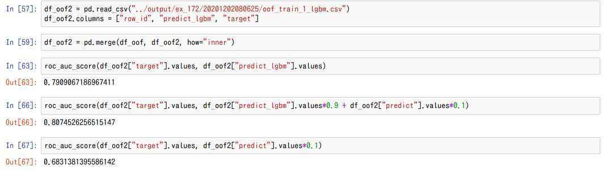

## experiment
[0.7885のlgbmとぶつける]
* model001: 再現性の確保, 10Mrow -> CV: 0.7374
* model002: max_len刻みにデータを取る -> CV: 0.7597
* model003: max_len=50 -> CV: 0.7581 ensemble-lgbm 0.7906(+0.002)
* model004: max_len=25 -> CV: 0.7562 ensemble-lgbm 0.7927(+0.004!?)
* model005: max_len=10 -> CV: 0.7515 ensemble-lgbm 0.7972(+0.01!?!?!?)
* model006: add part max_len=25 -> model007で実験!
* model007: model006 いろいろ組み合わせ -> CV: 0.761 enxemble 0.798(vs model5)
  * max: embed_dim=256, max_seq=10 CV: 0.772/embenble: 0.807
しばらくtransformerと心中しますか…。ベースライン出してから

# 2020/12/3
## experiment
* ex_173: ex_172 + lr=0.1
* model007の一番うしろのコレを、n_skill消した形で表現する?
  * あー！正解/不正解を表現しているということか！！
  * 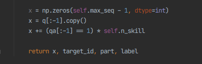
* model009: model008で一番良かったやつをfullmodel! ... メモリーエラーになるので
* model010: model009 head_30m

# 2020/12/4
* model011/model012: bugcheck
* model014: add lecture_id -> CV: 0.778(+0.006) eesnmble: 0.813(+0.006)

# 2020/12/5
## experiment
* model015: bugcheck.-> OK! all_predict vs partial_predict
* model016: model014 + user_answer: CV: 0.7890...あれ..
* model016まで、valがtrainに含まれていた。。実験やり直し。。

* model018: model007と同じ実験。。(epochs=6)
  * emb=128, seq=100, epoch=12 -> CV: 0.753; emb=128->256: CV 0.750(overfit...)
* model019: model018 + user_answerとか CV: 0.753(かわらず)
* model020: scheduler + AdamW lr=1e-4: underfitting lr=1e-3でもだめ
* model023: lag_time, timediff -> CV: 0.753(same)
* model024: model023 + batch_size=64 lr=3e-4
* model025: positional encoding. -> 失敗
* model026: positional encoding(decode) -> CV: 0.756
* model028: all data! -> CV: 0.7723.

* ex_174: part1-7 mean -> CV: 0.7887(+0.0002)
* ex_175: elapsed_time<=1000の件数カウント -> CV: 0.7887
# 2020/12/6
## experiment
* ex_178: past_useranswer+content_id_te -> CV: 0.7889
* ex_179: ex_178 + prev_ans_te iroiro -> CV: 0.7886
* ex_180: user_rate int -> float -> CV: 0.7888
* ex_181: 一回特徴全部作り直してみる -> CV: 0.7886 (PreviousAnswer500->300にしたのが更新されてなかったんだろうな)
* ex_182: UserAnswerLevelEncoderを導入(なぜかもれてた) -> CV: 0.7889(+0.0003)
* ex_183: past_useranswer_te minsize=300=>150 -> 0.7889
* ex_184: is_first_sessionを入れて、prior_question_had_explanationを消す -> 0.7888
* ex_185: userans_count_ratio: CV: 0.7890
* ex_186: elapsed_time<1000 count -> CV: 0.7889
* ex_187: timediff_elapsed
* ex_188: NN 256-128 -> CV: 0.7852 ensemble 0.7894
* ex_189: NN 512-256 -> CV: 0.7864 ensemble 0.7897
* ex_190: make_data_only

## EDA
* 037_postprocess あんまり意味なかった
* 041_１個前の問題の回答(QQ_tableをめちゃくちゃシンプルに)
  * 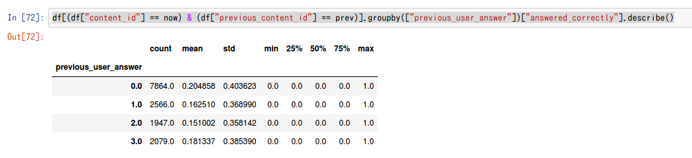
  * また、僕のモデルは、「間違ったか正しかったか」でしか判定していない。コレは効くはず。
    * 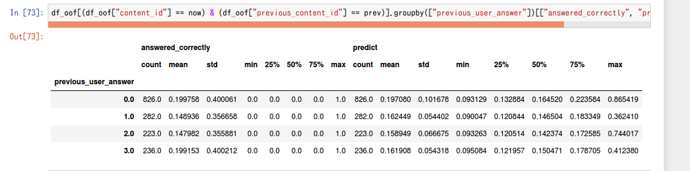
* 042_user_answer_pickle_check
  * min_size=300だと、prev_dictは18000くらい... -> min_size=150で再度試す

* 043_user_answer_statistics
  * 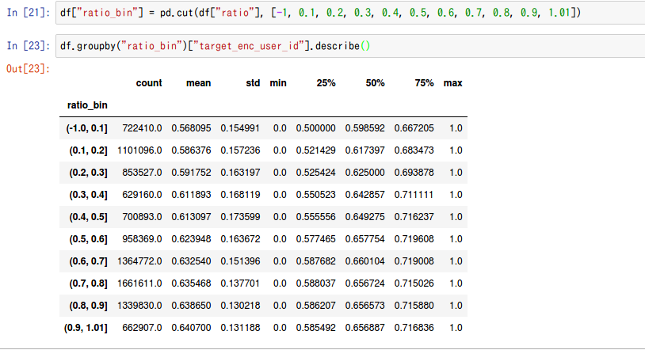

# 2020/12/7
* ex_191: past5 contentid/user_answerをshift1~5してanswer mean

