

# 2020/10/11

* 100Mのデータを処理するのは難しい
  * user_idを10で割ったあまりで、10個のデータに分ける→10個のモデルを作るってのはどうだろう?
  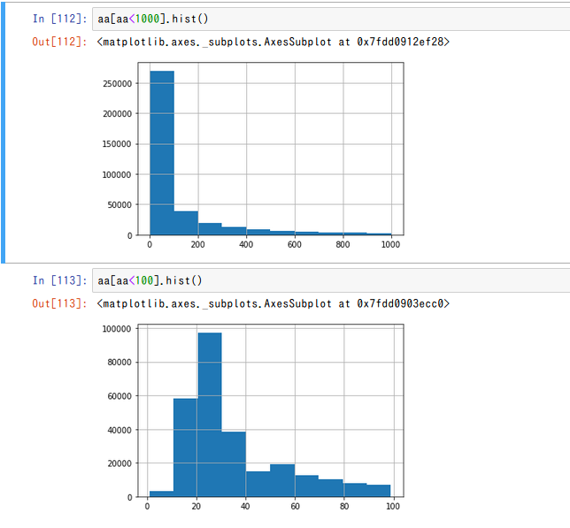

# 2020/10/12
* mlflowを導入
* target_encoding, intelligence_scoreの導入
  * intelligence_score: 問題毎に正解率の逆数を付与(難しいほど高い)
* とりあえずsubmissionスクリプト書いて回してみたけど…通るだろうか…

# 2020/10/13
* pickle -> featherで試してみる
* floatの不要な特徴は全部削除
* target encodingとかの特徴作成に時間かかってる。loadingはfeatherにしたことで解消した。

* 結局、partial_fitをすることで解消(PartialAggregator, ex005_pipeline)

# 2020/10/14
* exp005のモデル提出 CV:0.757(10fold-mean), LB: 0.743
* exp006: groupbyの項目を増やして試す
  * 全面的にクラス設計を見なおした
* exp007: 全データの1%のユーザーの行は全部validationに -> CVそんな変わらず

# 2020/10/15
* exp006の1モデル　CV:0.760 LB: 0.739
* exp008: CV: 0.761
  * trainはsplitだけとtestは全部マージしていることによるバグ修正
    * user_id削除
    * countencodingはuser_id以外は10倍にする
  * 項目増やす
* exp009 => CV:0.751
  * question, lectureの追加
  * answered_correctly=-1(lecture)も訓練してたバグ修正
* exp010 => parameter tuning. iteration少ない方が良さそう
  * lr=0.3にしてあといろいろ

# 2020/10/16
* exp009のpredict改良、fitは毎回やらない(10000件ごとに実施)
* exp011: 10model lr=0.3 => CV:0.754 LB:0.747
* exp012: 1model/50Mrow data
  * 固まって動かない。30Mrowでもダメ…辛い…
* exp013: tags1~tags6の特徴追加
  * tags1~tags6はあんまり効果なさそう
  * 20M行にして夜放置してみる

# 2020/10/17
## experiment
* exp013: CV: 0.756(10modelと比べて+0.005) LB: 0.742
* exp013-2: exp013はsplit_numミスってたので、それの修正 これとexp011-2どっちがいいか？
* exp014: 3model(30Mrow) => CV 0.757(1model, 2300epoch)途中で終わり
* exp011-2: exp013と同じモデルで、fitの頻度を10000=>300に変更: LB 0.750
* exp015: TargetEncoding with initial weight
  * user_idとtimestampでソートするよう修正。。
* exp016: TargetEncoding with initial weight + user_ability
##  EDA
  * tags 003_tags_vs_targetencoder
    * 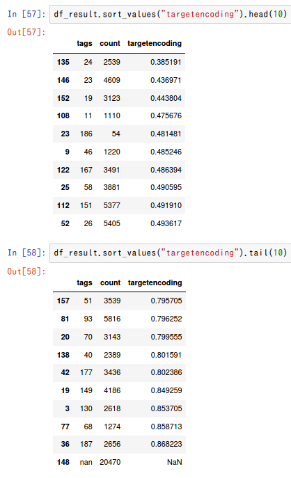
    * まあ、tags1~6のcountencodingで十分カバーできてるかなぁ…
  * user_id 004_user_id_answered_correctly
    * 成績悪い人、成績いい人を比較する
      * 成績悪い人はlecture受けてる件数が多い
        * 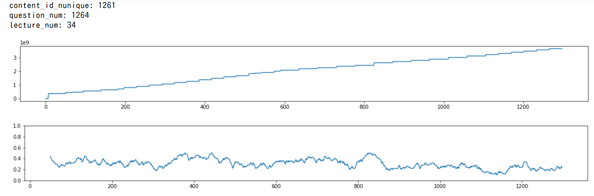
      * いい人はlecture受けてる件数が少ない
        * 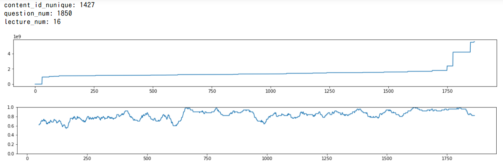
  * user_level
    * 頭が良ければ正解率高いとは限らん。その人にあった問題を選んで勉強するはず。そのレベルを見る。
      * 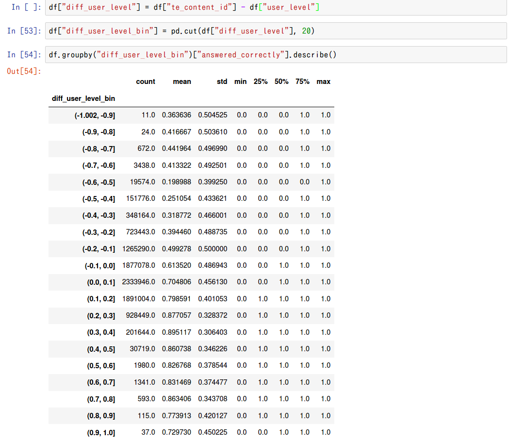
      * 
    * target_encoding, 初期値ブレがち。200件*0.655を最初から加重しとくのがよさそう！ -> exp015
      * 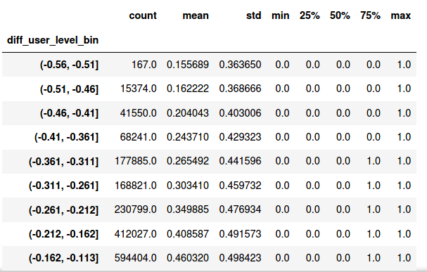

# 2020/10/18
## experiment
* exp015: TargetEncoding with initial weight => CV: 0.752(1model) +0.002 from exp011 -> LB: 0.732(!?)
  * user_idとtimestampでソートするよう修正。
* exp016: TargetEncoding with initial weight + user_ability => CV: 0.756) +0.006 from exp011 -> LB: 0.666(!?!?)
* exp017: initial_score, initial_weight設定忘れてる...
  * あと、なんかexp015, exp016がuser_idとcontent_idの順番逆なのになぜか動いていたっぽい。けど今は動かない。
  * スコアが低いのもそこらへんでなんかバグってるのが要因では。。
* exp018: exp011を20model -> LB: 0.750
* exp019: exp011 + nunique, shiftdiff
## EDA
* 006_previous_X
  * questionに絞ると、前のquestionと今のquestionが一緒の場合、正解率は高い(当たり前か!?)
  * 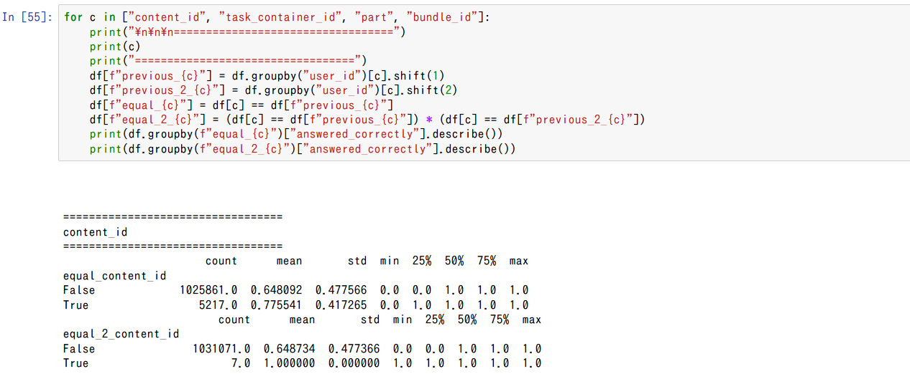
  * timestamp_diffみると、1000~10000は正解率低い
  * 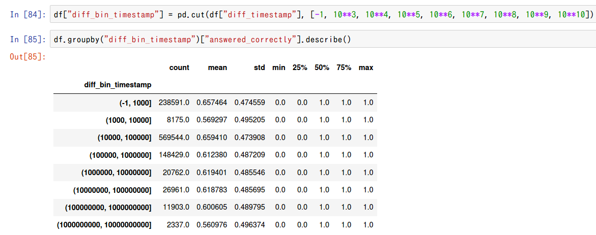

# 2020/10/19
* exp019 -> CV: 0.764 / LB: 0.751
* exp020: exp011を丸コピ(exp019が上がりすぎてるので怪しい。。) -> CV戻った
* exp021: user_levelのみ + exp019 (sort_valueなし) -> CV: 0.769 / LB: 0.711 :(
* exp022: exp021 + lecture.csvなし
* exp023: exp021 + type_of, tag 使う

# 2020/10/20
* predictionの特徴作成本当にあってるか、確認するスクリプト作成 ok
* exp023: target_encoderがリークしてた…のか。
  * is_partial_fit：未来のデータで過去のデータをencodeしている
* exp024: environmentちゃんと動いてるか確認(CVとかは見ない) exp021でやる
* exp021_2: exp021 + partial_predict_mode変更

# 2020/10/21
## EDA
* 007_shiftdiff
  * 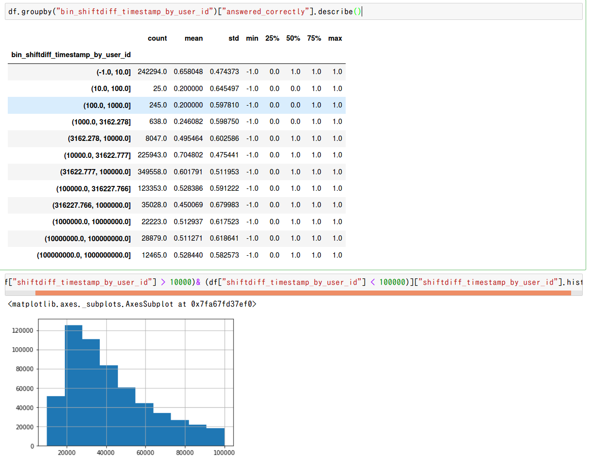

## experiment
* exp019_2: shiftdiffをリアルタイムに -> LB: 0.756!

# 2020/10/22
## experiment
* exp025: user_levelとnuniqueを削って、content_id系だけ早く更新する -> CV: 0.723?
  * バグってるので要確認
* exp026: ("user_id", "content_id")を加える
* exp027: parameter tuning 旅行中

# 2020/10/23
## experiment
* exp025-2: update_record=50

# 2020/10/25
## experiment
* exp028 parameter tuning結果の反映(base: exp019)

# 2020/10/26
## EDA
* answerの精度が低い人、user_answerが0, 3に固まりがち

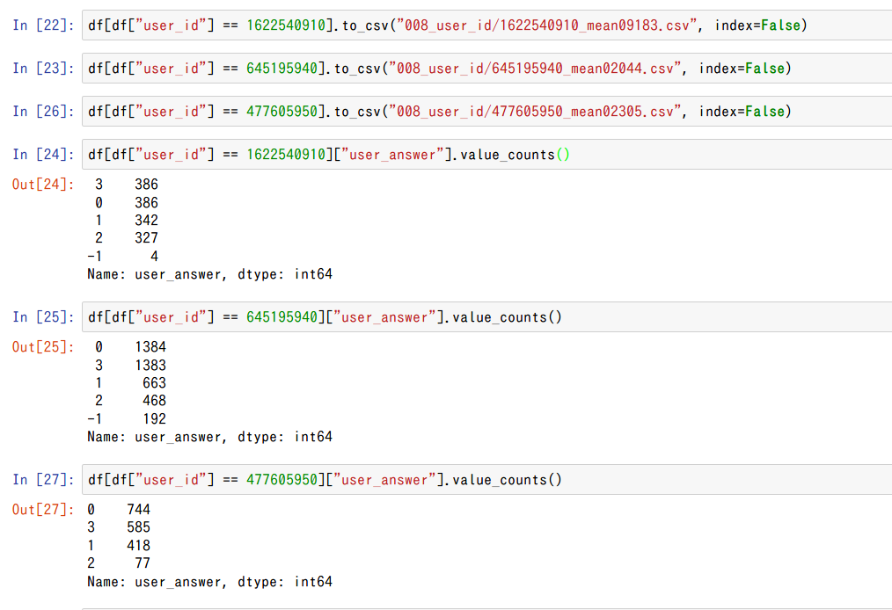

* そもそも、answer=2が少ない…

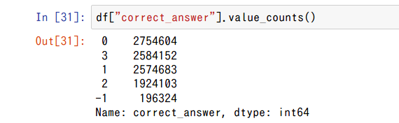

# 2020/10/27
## experiment
* exp029: 各target_encをuser_idのtarget_encとぶつける -> CVかわらず

# 2020/10/28
## experiment
* exp030: user_levelに再トライ -> 1modelのみでいったんsub
* exp031: counter(その時点までに何回該当カテゴリを通っているか?)

# 2020/10/29
* exp032: user_levelだけにしてpartial_predictとall_predict比較
-> 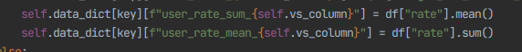
-> LB: 0.766!
* そのまま、exp031と同条件で、partial vs all での精度を比較

# 2020/10/30
## EDA
* 過去にこのユーザーが同じquestionを解いたか
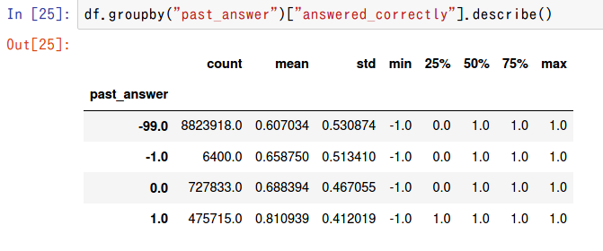

## experiment
* exp033: exp031 + 1個前の解答 (とりあえず生コードで）-> CV: 0.772
* だけどメモリーエラー…

# 2020/10/31
## experiment
* exp034: shiftdiff(content_id)! (直近が同じか?) -> あんまり変わらず
* exp035: exp030と同じ特徴量、CountEncoderのバグ修正したやつ
* exp036
  * content_type_idのtarget_encodingは不要
  * partはtarget_encoding, level必要
  * {prior_question_had_explanation, correct_answer}
  * {prior_question_had_explanation, part}
* exp037
  * tag全部もり(subは流石に無理そうなので無し)
## EDA
* 011_user_answer
  * correct_answerのバランス悪いのなんでだろう
    * 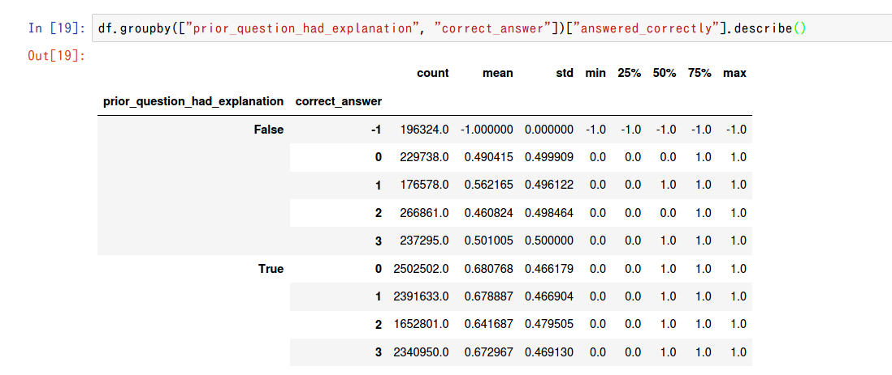
  * exp036に、{prior_question_had_explanation, correct_answer}を加える

* 012_prior_question
  * partとぶつける
    * 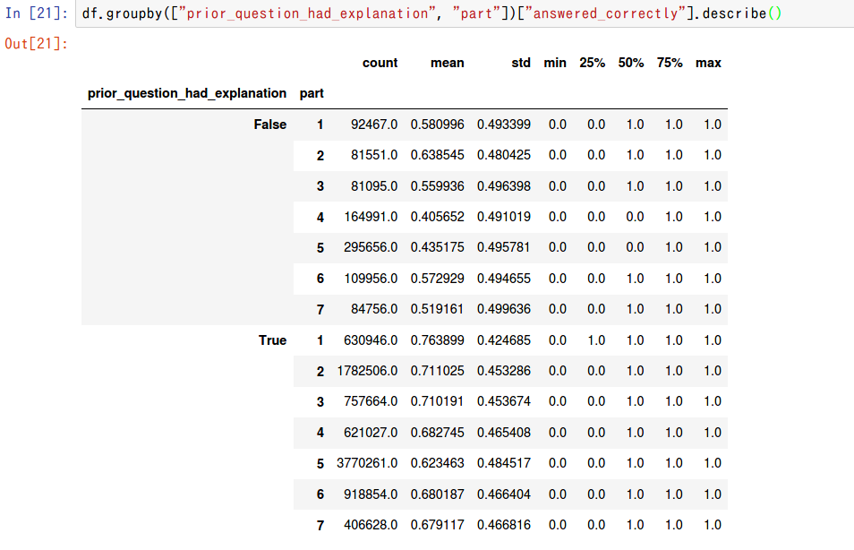
  * exp036に、{prior_question_had_explanation, part}を加える

* 013_bundle_id
  * 特になし。。

* 014_part
  * part vs 時間diffで相関あるか？ -> part7は結構顕著に出てる
    * 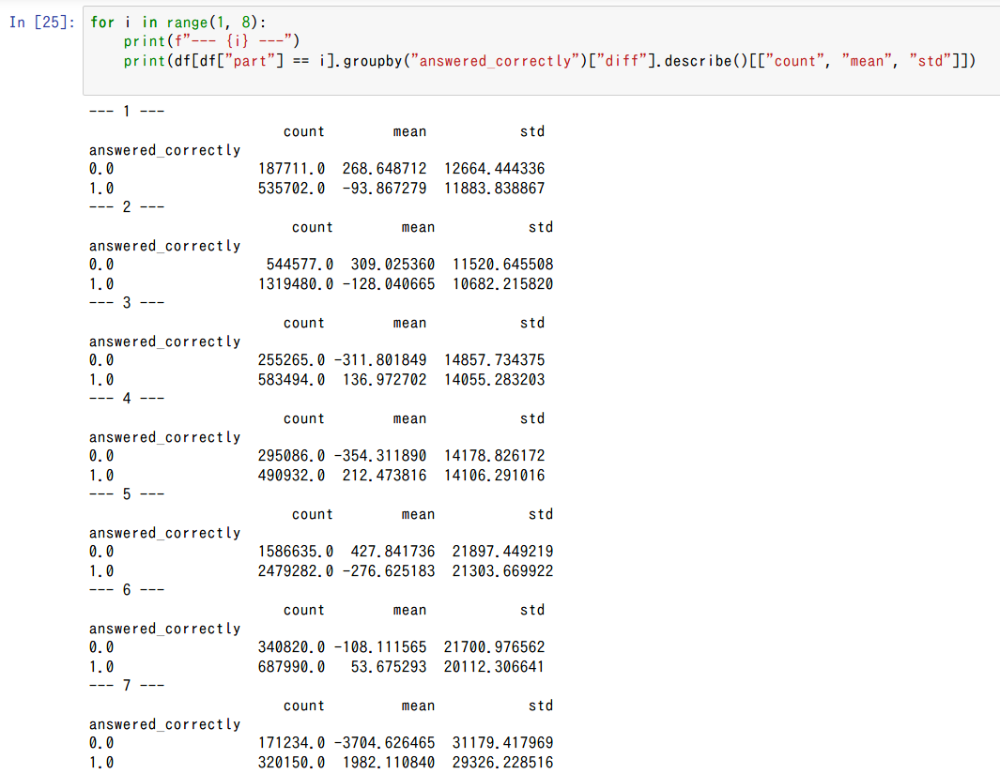
    * exp036に、groupby("part")["time"].mean()
  * partごとのtarget平均
    * 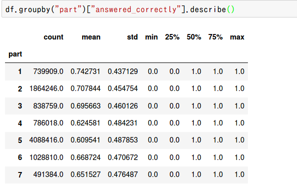
  * user_id/partごとの正解率相関
    * 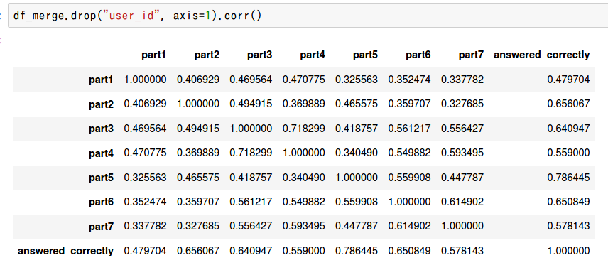
    * 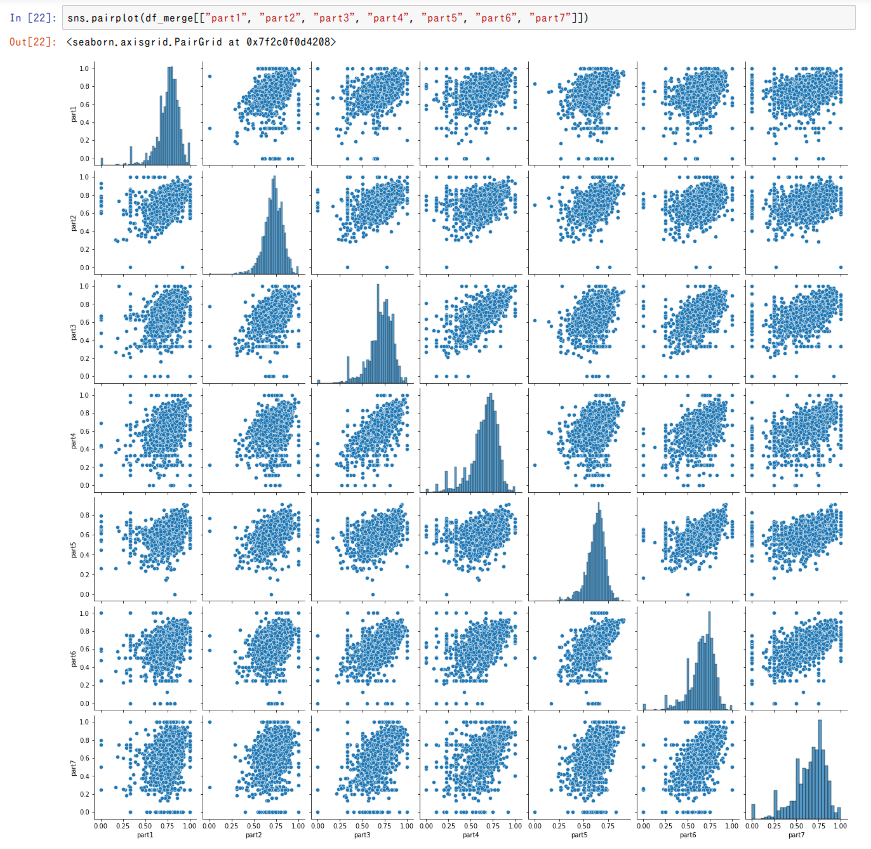

# 2020/11/1
## experiment
* ex_036: CV: 0.771 LB: 0.775!!
* ex_038
  * max_bin=1024 -> そんなに変わらない
  * feature_fraction=0.1
* ex_037(tag全部もり) -> あんまりスコア変わらない
* ex_039
  * count_bin追加, partごと/count_binごとのCategoryLevelEncoder
  * diff_rate_mean_target_enc_part_1が強い。part1なんか大事そう
* ex_040
  * prior_question+user_count_bin, content_id+prior_question_had_explanation
  * part+prior_question_elapsed_time_bin

## eda
* 016_user_id
  * 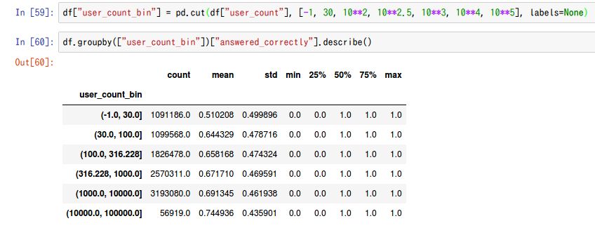
  * prior_question_had_explanationは、最初のほうが顕著に正解率下がる
    * 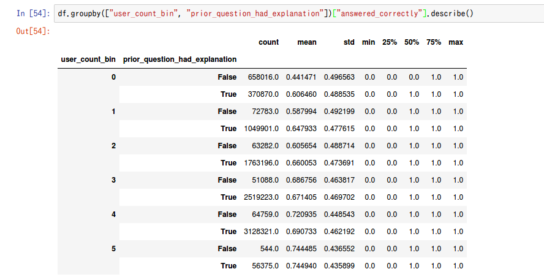
* 017_prior_question_elapsed_time
  * partごとに、かけた時間と正解率が違う。確かに、文法なんかはわかったら一瞬

# 2020/11/2
## experiment
* ex_039はtimeup
  * CategoryLevelEncoderが時間食ってる(あたりまえ)
* ex_041 -> CV: 0.771 / LB: 0.777
  * CategoryLevel: part=(2, 5), bin=(0)
  * pickle化も同時にやる
* ex_042 -> model1: CV0.768をみて撤退
  * base_ex041
  * LevelEncoder系、全部[content_id, prior_question_had_explanation]にする
* ex_043 ->
  * base_ex_041
  * PriorQuestionElapsedTimeDiv10Encoder -> ほとんどfeatureimporance0

## EDA
* 018_prior_question_time
  * 10で割ったら…
  * 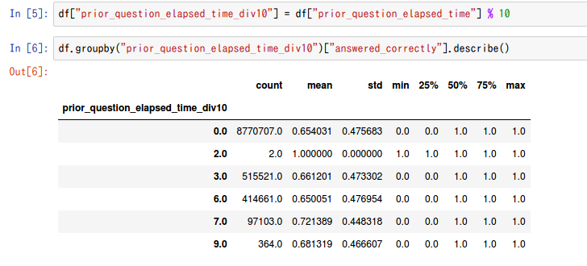

# 2020/11/3
## experiment
* ex_046: hyperparam tuning

# 2020/11/4
## experiment
* ex_047: parameter tuned & lr=0.1
* ex_048: previous_answer(reduce memory)
* ex_049: reduce features

# 2020/11/6

