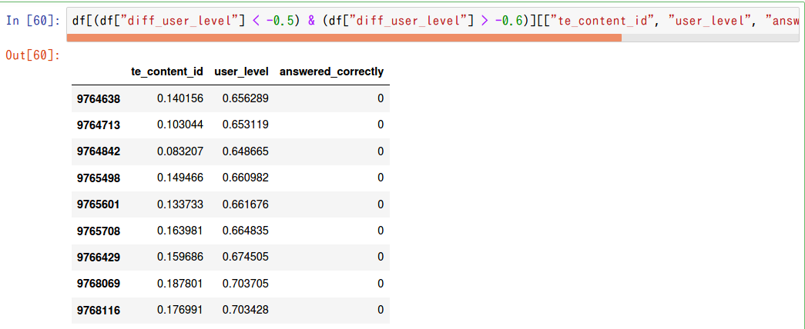
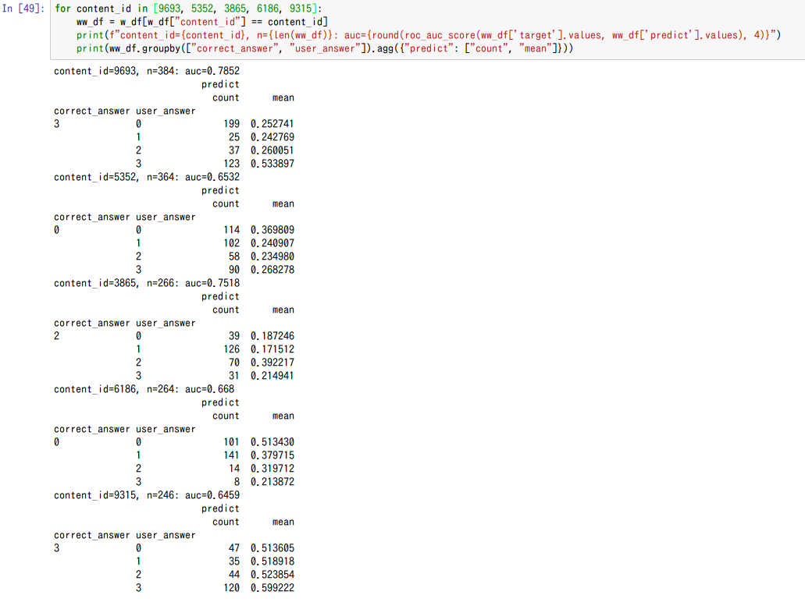

# 2020/10/11

* 100Mのデータを処理するのは難しい
  * user_idを10で割ったあまりで、10個のデータに分ける→10個のモデルを作るってのはどうだろう?
  

# 2020/10/12
* mlflowを導入
* target_encoding, intelligence_scoreの導入
  * intelligence_score: 問題毎に正解率の逆数を付与(難しいほど高い)
* とりあえずsubmissionスクリプト書いて回してみたけど…通るだろうか…

# 2020/10/13
* pickle -> featherで試してみる
* floatの不要な特徴は全部削除
* target encodingとかの特徴作成に時間かかってる。loadingはfeatherにしたことで解消した。

* 結局、partial_fitをすることで解消(PartialAggregator, ex005_pipeline)

# 2020/10/14
* exp005のモデル提出 CV:0.757(10fold-mean), LB: 0.743
* exp006: groupbyの項目を増やして試す
  * 全面的にクラス設計を見なおした
* exp007: 全データの1%のユーザーの行は全部validationに -> CVそんな変わらず

# 2020/10/15
* exp006の1モデル　CV:0.760 LB: 0.739
* exp008: CV: 0.761
  * trainはsplitだけとtestは全部マージしていることによるバグ修正
    * user_id削除
    * countencodingはuser_id以外は10倍にする
  * 項目増やす
* exp009 => CV:0.751
  * question, lectureの追加
  * answered_correctly=-1(lecture)も訓練してたバグ修正
* exp010 => parameter tuning. iteration少ない方が良さそう
  * lr=0.3にしてあといろいろ

# 2020/10/16
* exp009のpredict改良、fitは毎回やらない(10000件ごとに実施)
* exp011: 10model lr=0.3 => CV:0.754 LB:0.747
* exp012: 1model/50Mrow data
  * 固まって動かない。30Mrowでもダメ…辛い…
* exp013: tags1~tags6の特徴追加
  * tags1~tags6はあんまり効果なさそう
  * 20M行にして夜放置してみる

# 2020/10/17
## experiment
* exp013: CV: 0.756(10modelと比べて+0.005) LB: 0.742
* exp013-2: exp013はsplit_numミスってたので、それの修正 これとexp011-2どっちがいいか？
* exp014: 3model(30Mrow) => CV 0.757(1model, 2300epoch)途中で終わり
* exp011-2: exp013と同じモデルで、fitの頻度を10000=>300に変更: LB 0.750
* exp015: TargetEncoding with initial weight
  * user_idとtimestampでソートするよう修正。。
* exp016: TargetEncoding with initial weight + user_ability
##  EDA
  * tags 003_tags_vs_targetencoder
    * 
    * まあ、tags1~6のcountencodingで十分カバーできてるかなぁ…
  * user_id 004_user_id_answered_correctly
    * 成績悪い人、成績いい人を比較する
      * 成績悪い人はlecture受けてる件数が多い
        * 
      * いい人はlecture受けてる件数が少ない
        * 
  * user_level
    * 頭が良ければ正解率高いとは限らん。その人にあった問題を選んで勉強するはず。そのレベルを見る。
      * 
      * 
    * target_encoding, 初期値ブレがち。200件*0.655を最初から加重しとくのがよさそう！ -> exp015
      * 

# 2020/10/18
## experiment
* exp015: TargetEncoding with initial weight => CV: 0.752(1model) +0.002 from exp011 -> LB: 0.732(!?)
  * user_idとtimestampでソートするよう修正。
* exp016: TargetEncoding with initial weight + user_ability => CV: 0.756) +0.006 from exp011 -> LB: 0.666(!?!?)
* exp017: initial_score, initial_weight設定忘れてる...
  * あと、なんかexp015, exp016がuser_idとcontent_idの順番逆なのになぜか動いていたっぽい。けど今は動かない。
  * スコアが低いのもそこらへんでなんかバグってるのが要因では。。
* exp018: exp011を20model -> LB: 0.750
* exp019: exp011 + nunique, shiftdiff
## EDA
* 006_previous_X
  * questionに絞ると、前のquestionと今のquestionが一緒の場合、正解率は高い(当たり前か!?)
  * 
  * timestamp_diffみると、1000~10000は正解率低い
  * 

# 2020/10/19
* exp019 -> CV: 0.764 / LB: 0.751
* exp020: exp011を丸コピ(exp019が上がりすぎてるので怪しい。。) -> CV戻った
* exp021: user_levelのみ + exp019 (sort_valueなし) -> CV: 0.769 / LB: 0.711 :(
* exp022: exp021 + lecture.csvなし
* exp023: exp021 + type_of, tag 使う

# 2020/10/20
* predictionの特徴作成本当にあってるか、確認するスクリプト作成 ok
* exp023: target_encoderがリークしてた…のか。
  * is_partial_fit：未来のデータで過去のデータをencodeしている
* exp024: environmentちゃんと動いてるか確認(CVとかは見ない) exp021でやる
* exp021_2: exp021 + partial_predict_mode変更

# 2020/10/21
## EDA
* 007_shiftdiff
  * 

## experiment
* exp019_2: shiftdiffをリアルタイムに -> LB: 0.756!

# 2020/10/22
## experiment
* exp025: user_levelとnuniqueを削って、content_id系だけ早く更新する -> CV: 0.723?
  * バグってるので要確認
* exp026: ("user_id", "content_id")を加える
* exp027: parameter tuning 旅行中

# 2020/10/23
## experiment
* exp025-2: update_record=50

# 2020/10/25
## experiment
* exp028 parameter tuning結果の反映(base: exp019)

# 2020/10/26
## EDA
* answerの精度が低い人、user_answerが0, 3に固まりがち

* そもそも、answer=2が少ない…

# 2020/10/27
## experiment
* exp029: 各target_encをuser_idのtarget_encとぶつける -> CVかわらず

# 2020/10/28
## experiment
* exp030: user_levelに再トライ -> 1modelのみでいったんsub
* exp031: counter(その時点までに何回該当カテゴリを通っているか?)

# 2020/10/29
* exp032: user_levelだけにしてpartial_predictとall_predict比較
-> 
-> LB: 0.766!
* そのまま、exp031と同条件で、partial vs all での精度を比較

# 2020/10/30
## EDA
* 過去にこのユーザーが同じquestionを解いたか

## experiment
* exp033: exp031 + 1個前の解答 (とりあえず生コードで）-> CV: 0.772
* だけどメモリーエラー…

# 2020/10/31
## experiment
* exp034: shiftdiff(content_id)! (直近が同じか?) -> あんまり変わらず
* exp035: exp030と同じ特徴量、CountEncoderのバグ修正したやつ
* exp036
  * content_type_idのtarget_encodingは不要
  * partはtarget_encoding, level必要
  * {prior_question_had_explanation, correct_answer}
  * {prior_question_had_explanation, part}
* exp037
  * tag全部もり(subは流石に無理そうなので無し)
## EDA
* 011_user_answer
  * correct_answerのバランス悪いのなんでだろう
    * 
  * exp036に、{prior_question_had_explanation, correct_answer}を加える

* 012_prior_question
  * partとぶつける
    * 
  * exp036に、{prior_question_had_explanation, part}を加える

* 013_bundle_id
  * 特になし。。

* 014_part
  * part vs 時間diffで相関あるか？ -> part7は結構顕著に出てる
    * 
    * exp036に、groupby("part")["time"].mean()
  * partごとのtarget平均
    * 
  * user_id/partごとの正解率相関
    * 
    * 

# 2020/11/1
## experiment
* ex_036: CV: 0.771 LB: 0.775!!
* ex_038
  * max_bin=1024 -> そんなに変わらない
  * feature_fraction=0.1
* ex_037(tag全部もり) -> あんまりスコア変わらない
* ex_039
  * count_bin追加, partごと/count_binごとのCategoryLevelEncoder
  * diff_rate_mean_target_enc_part_1が強い。part1なんか大事そう
* ex_040
  * prior_question+user_count_bin, content_id+prior_question_had_explanation
  * part+prior_question_elapsed_time_bin

## eda
* 016_user_id
  * 
  * prior_question_had_explanationは、最初のほうが顕著に正解率下がる
    * 
* 017_prior_question_elapsed_time
  * partごとに、かけた時間と正解率が違う。確かに、文法なんかはわかったら一瞬

# 2020/11/2
## experiment
* ex_039はtimeup
  * CategoryLevelEncoderが時間食ってる(あたりまえ)
* ex_041 -> CV: 0.771 / LB: 0.777
  * CategoryLevel: part=(2, 5), bin=(0)
  * pickle化も同時にやる
* ex_042 -> model1: CV0.768をみて撤退
  * base_ex041
  * LevelEncoder系、全部[content_id, prior_question_had_explanation]にする
* ex_043 ->
  * base_ex_041
  * PriorQuestionElapsedTimeDiv10Encoder -> ほとんどfeatureimporance0

## EDA
* 018_prior_question_time
  * 10で割ったら…
  * 

# 2020/11/3
## experiment
* ex_046: hyperparam tuning

# 2020/11/4
## experiment
* ex_047: parameter tuned & lr=0.1 -> CV+0.001だがLBあまりかわらず
* ex_048: previous_answer(reduce memory)
* ex_049: reduce features => CV: 0.776 / LB: 0.784(freq=30)

# 2020/11/6
## experiment
* ex_050: nnを試す
* ex_051: minimam_nn(64-32-1) => CV: 0.755

# 2020/11/7
## experiment
* ex_048_3: 再度試す(速度改善ver)

## EDA
* ex_052:
  * PreviousAnswerにindexつける! (ex_048とコード自体はかわらない) => CV: 0.777(only model-0)
* 020_previous_xxx
  * part / content_id
    * 
  * shift1_contentid: 正解したのにもう1回やってる人いる。単純に間違えただけでは? => ex_052: previous_answer3
    * 
  * shift2_contentid: 間違えた! -> 教材見て -> もう1度復習　…これ、頑張ればquestionとlectureひも付けられそう
    * 
  * shift3_contentid: shift2とおなじ(ちょっとタイムラグあるだけ)
    * 
* 021_lecture-question
  * shift2_contentidで見つけたquestionとlectureをひも付けて、lectureを受けた人・受けてない人での正解率探す -> やっぱり受けた人のほうが正解率高い
    * 

# 2020/11/8
## experiment
* ex_053: question_lecture_map
* ex_052_2: previous_answerのバグ直して再提出 -> LB: 0.780(down...)
* ex_054: catboost(feature: ex_052) depth tuning

# 2020/11/9
## experiment
* ex_052_2: indexリアルタイム更新にして再度提出 -> LB: 0.780...
* ex_055_0: PreviousAnswer、indexあり版でindex消すとCV0.770, indexなし版CV0.773
  * なぜ？データ確認する -> user_idのみでgroupbyしてたので、単純に「前の問題に正解してるか」になってた
* ex_055_0_1: answer_idxもバグ確認
* ex_055: indexなしで1回subする(=exp048)
  * 原因がindexなのかanswerなのかで切り分けたい+スコア更新したい
* ex_056: ex_055+cat&lgbm
* ex_057: ex_056+index
  * lgbm CV: 0.779 -> LB: 0.786
  * cat CV: 0.780 -> LB: 0.783
  * lgbm+cat CV: 0.781(たぶん)

# 2020/11/10
## eda
* 022_previous_content
  * previous_content_type_id 1個前がlectureのときのほうが正解率高い -> 特徴に追加
    * 
  * 更に見ていくと, content_type_id=[1, 0]の順番でのconunt_encoderで、数が多いほど正解率が高い。コレは使えそう
    * 

# 2020/11/11
## experiment
* ex_059: depth tuning
* ex_060: ex_057+previous_lecture -> CV: 0.7770(変化なし?)
* ex_061: ex_060+initial_weight/initial_score -> CV: 0.777(ex_060とあんま変わらず)
* ex_062: ex_057+content_level_encoder -> CV: 0.7778(first model)
* ex_057とex_049でuser_rate系の値が違う
  * df.sum(), df.values.sum()、後者はnp.nanがあるとsumもnanになるよ！
  * ex_057_2.pyでfeature_factory_manager作り直し

# 2020/11/12
## experiment
* ex_063: ex_062 + groupby(user_id).mean(content_level)
  * TODO: groupby(content_id).mean(user_id)もしたいけど、ライブラリの制約でできねぇ…改造するか
* ex_064: ex_063のdf_train->fit vs all_predict
  * データの順番変えたらそりゃ結果かわるよね -> データの順番も完全一致させる？ -> いや、そこはあわせてたっぽい

# 2020/11/13
## experiment
* ex_066: ex_057 + bugfix -> CV: 0.7773(model1) LB: 0.786
* ex_067: target_enc_content_idをuser_idなどでdiffとりまくる(userにとって簡単かどうか?) -> CV: 0.7780(model1)
* ex_068: ex_067 + FirstPart, FirstContentId -> CV: 0.7782(model1)
* ex_069: ex_068 + First1~5Ans -> CV: 0.7780(model1) down...
* ex_070: ex_068 + user情報からcontentの難しさを測るという発想なら、逆もありでは?
  * target_enc_user_idをcontent情報系で -> 0.7782(model1)
* ex_072: ex_070 + map
* ex_072_0: map作り直し(threshold=300->50)

## EDA
* 023_first_X_answered_correctly -> 特徴に加えてみる
  * 
* 024_first_XXX
  * TOEICの目標点によって変わるのでは?
    * content_id=7900が圧倒的に多いっぽい
      * 
    * part: 5が多いっぽい。ただcontent_id=7900はpart=1だけどね。。
      * 

# 2020/11/14
## experiment
* ex_073: countencoderを全部抜く -> CV: 0.7779(model0) LB: 0.786
* ex_074: PreviousAnswer, 500問以上前はnp.nan! (ex_073と内容一緒) model1 only CV: 0.7772(-0.0007)
* ex_075: ex_066を20Mrow-10model
* ex_076: ex_074 + session加える, shiftdiffを消す(※SessionEncoderはall_predictしか書いてない) CV: 0.7785
* ex_077: ex_077 + previous3answer CV: 0.7785 (+ 0.0006)
* ex_078: ex_074 + intention_count, target_enc_content_id_mean

## EDA
* 025_session: 学習セッション
  * sessionごとの正解率：最初が低い。。けどこれはすでに捉えてそう
    * 
  * sessionごとに今何問目？の正解率
    * 0~30は低いが、30~で多くなってる。。まあこれも捉えてるんかなぁ…(一番最初のsession影響?)
    * あと0は極端に低いな
      * 
      * 
* 026_prev_n_answer_correctly:
  * あんまりuser_idとの相関もないし、結構効きそうだぞコレは!ただ、fitがリアルタイムじゃないからリークしてるかもなぁ
    * 

## other
* GCP instance -> あきらめ…
  * https://qiita.com/inumaru9n/items/e8250af967431c46ad45

# 2020/11/15
## experiment
* ex_078: Counter(intention), TargetEncAggわちゃわち -> 0.7782
* ex_079: 特徴カット(ex_074 base) -> 0.77719
* ex_080: ql_map -> 0.77910
* ex_081: ex_076-ex_080をあわせた -> 0.77938
* ex_082: ex_081のTargetEncをcontent_idにしぼりこみ -> 0.77938(いっしょ)
* ex_083: Session抜く -> 0.77887
* ex_084: Session抜いてとりあえず10model -> CV: 0.7786(model1) LB: 0.782 (-0.004)
* ex_085: ex_084の20Mrow version

## EDA
* 027_lecture_typeof
  * intentionはちょっと効くかな?って感じ
  * 

## other
* performance tuning.
  * fit
      * ContentLevelEncoder 90ms -> 50ms
      * CategoryLevelEncoder 70+80ms -> 10+10ms

# 2020/11/16
## experiment
* ex_086: te_content - (te_user系), te_user - (te_content系) -> CV: 0.7779

# 2020/11/17
## experiment
* ex_088: bug check
  * te_xxx: df.values.mean とかにしてた. numpyはnullが１個でもあるとだめだよ
  * previousNanswer: なんかバグってる -> partial_predictが更新ありの場合、is_partial_fit=Trueだと２回更新されちゃう
* ex_084をもう一度(CVのみ) -> CV: 0.7785(model1, -0.0001)
* ex_089: QLtable2
  * 精度変わらず
    * QLtableは0-1の引き算, QLtable2は生値？ -> QLtable2を引き算に変更
    * よくみたら単純にバグってただけ…
    * QLtable diff -> model1 CV: 0.7798(100epoch)-0.7805(200epoch)
    * QLtable normal -> model1 CV: 0.7832(100epoch)-0.7841(200epoch)
* ex_084: もう一度, fitだけしてサブする
* ex_090: ex_089を20Mrow(GCP) -> CV: 0.7873(model0+1)
* ex_091: ex_089 + 昔消した特徴たち

## other
* 処理の並列化
  * https://qiita.com/uo_ta/items/8d265a0f03300ebc2635

# 2020/11/18
## EDA
* 028_user_answer_and_content_id
  * 

# 2020/11/19
## other
GCP上でアップロード:  
kaggle datasets init -p riiid_code/

kaggle datasets version -p riiid_code/ --dir-mode "zip" -m "test"

# 2020/11/20
## experiment
* ex_094: 50M rows

# 2020/11/21
## experiment
* ex_089(finalize): CV. 0.7830(model0)
* ex_095: ex_089 + qq_table CV: 0.7836
  * 空欄が目立つ…もうちょいデータとっても良さそう
  * 
* ex_096: ex_089 + useranswer_table CV: 0.7837
* ex_097: ex_089 + weighted_te CV: 0.78366
* ex_098: ex_089 + qq_table(min_size=500?) 元気があれば CV: 0.7836
* ex_099: 全部のせ　CV: 0.7843(model0) -> CV: 0.7843

# 2020/11/22
## experiment
* ex_100: ex_100 + user_content_rate -> CV: 0.7852 (+0.0009)
* ex_101: ql_tableは条件厳し目(min_size=1000) -> CV: 0.7830(-0.002)
* ex_102: lgbm update + ex_101
* ex_103: re-think data validation(10% all new user, 90%: train9:val1) -> CV: 0.7822(-0.0008)
* ex_104: ex_103 + Elo Rating -> CV: 0.7824(+0.0002)
* ex_105: ex_104 + Elo Rating(user_id, part) -> CV: 0.7827(+0.0003)
* ex_106: initial_rateを最初の問題にあわせる -> CV: 0.7825
* ex_107: ex_105 + Elo Rating(user_id, tags) -> CV: 0.7832
* ex_108: ex_107 - weightedte -> CV: 0.7833
* ex_109: ex_108 - te : CV: 0.7829
## EDA
* 030_prior_question_user_count -> prior_question_had_explanationでtarget encodeするの、情報を圧縮してる。
  * user_count_binでやるのが正しい
  * [image_41](image_41.png)
* 031_check_auc
  * TOTAL: 0.7821
  * user_count
    * <30: 0.7629 (n=148399)
    * >30: 0.7796 (n=1637174)
  * part -> part2, part5の精度が悪いっぽい
      * part=1, n=115860: auc=0.809
      * part=2, n=356685: auc=0.7552
      * part=3, n=150430: auc=0.8008
      * part=4, n=137949: auc=0.8173
      * part=5, n=775714: auc=0.76
      * part=6, n=181319: auc=0.7977
      * part=7, n=107240: auc=0.8192
  * part2(3択)
    * 
  * part5
    * 

# 2020/11/23
## Experiment
* ex_111: user_answer/user_idを消す(重すぎる) -> CV: 0.7824
* ex_112: part5 only -> 0.7605
* ex_113: category(tags1, tags2, content_id) -> 0.7832
* ex_114: ex_113 + user_id(本番では使えないけど) -> 0.7832
* ex_115: tags6まで入れた -> 0.7832
* ex_116: Counterを入れた(content_type_id, part) -> 0.7832(変わらず)
* ex_117: (user_id, part).mean("prior_question_elapsed") -> 0.7833
* ex_118: study_time -> 0.7850
* ex_119: userlevelとかcontentlevelがバグってると思うので消す -> CV: 0.7846 -> LB: 0.792!!
* ex_120: lr=0.3 -> 0.1 & cat CV: (lgbm: 0.7866, cat0.7849, ensemble0.7876) -> lgbm LB: 0.793!!
  * ただしcatはcategorical feature指定なし。4時間/model の時間がかかるので…

## EDA
* 032_check_low_auc_tag\
  * 

  * 分布見てみると、「もう予想できませーん」っていってるようなもん
  * 

# 2020/11/24
## experiment
* ex_121: QQ_table/QL_table -> threshold=100にしてみる。overfitしたのは別の原因ではCategory Level Encoderとかが悪さしてそうだし…
-> CV: 0.7897 / LB: 0.793(へんかなし)

## EDA
* 036_w2v and swem

# 2020/11/25
## experiment
* ex_122: W2V
  * BaseLine(lr=0.3) -> CV: 0.7885
  * window10-size3: CV: 0.7884
  * window10-size5: CV: 0.7886
  * window10-size10:  CV 0.7884
  * window20-size3: 0.7886
  * window20-size5: 0.7887
  * window20-size10: 0.7884
  * window50-size3: 0.7883
  * window50-size5: 0.7886
  * window50-size10: 0.7883
* ex_123: TargetEncoding(tags1, tags2) -> CV: 0.7876
* ex_124: ex_123 + Counter + regression -> CV: 0.7877
* ex_125: ex_123 + Counter -> CV: 0.7877
* ex_126: listening-readingでわけてrating + tta -> CV: 0.78729 -> 0.78734
* ex_127: study time fix(shift: -1) -> CV: 0.7937(+0.006) だけどこれはリークだよね
  * でも、elapsed_timeがわかると強いってことはわかった
* ex_128: ElapsedTimeVsShiftDiffEncoder -> CV: 0.7880
* ex_129: ShiftDiff replace(0 -> bfill)になおした(bundle_id対応) -> CV: 0.7889
* ex_130: prior_question_elapsed_timeよりも、shiftdiff_timeのmeanのほうが効きそう -> CV: 0.7889
  * ただし、>200000は消す処理入れたやつにする、study_timeとかも全部
* ex_131: shiftdiff_time だけじゃなくて、prior_question_elapsed_timeにしとく -> CV: 0.7890
* ex_132: ex_131 + top40 features CV: 0.7886
## survey
* DSB2019
  * 1st
    * statistics: last N hour features.
    * event interval features / Density
      * 過去何日でpart/tagをやった日数
      * 一番最後のpart/tag timestamp, index
    * video skip prop ratio
      * Counter(prior_question_had_explanation)
    * data augmentation??
  * 2nd
    * Decayed Historical feature.
  * 7th
    * On the Measure of Intelligence https://arxiv.org/abs/1911.01547
    * learning tempo. (どれくらいのテンポで各個人が学習するのか)
    * rating mean
  * 15th: https://www.kaggle.com/c/data-science-bowl-2019/discussion/127500
    * decaying counter
    * Past assessment features: 正解時、失敗時に使った時間の平均

# 2020/11/26
* ex_133: QQ-Table2
  * min_size=1000だと十分なサンプル集まらず。。min_size=300でre-try

# 2020/11/27
* ex_134: past10_user_rate,content_rate, te_user_id, te_content_id -> 0.7889
* ex_135: past10_user_rate min/max/mean/std -> 0.7889
* ex_136: timediff -> 0.7898(+0.0008!!) 採用! (past5, past50だけ)
* ex_137: prior_question_elapsed_time_mean -> 0.7892
* ex_138: timediff  + diff-diff(past5, past50) -> 0.7898
* ex_139: tagsencoder -> Cv: 0.7901
* ex_140: QQTable2 + QQTable -> CV: 0.7902 (QQTableは全データを使っているのに対し、QQTable2はmodel0の300万件しか使ってない
  * QQTable2を採用する(ex_139)
* ex_141: ex_139 - diff-diff -> CV: 0.7901

# 2020/11/28
## experiments
* ex_142: 意外とtagsが効いてない…けしてみる -> CV: 0.7899 (これくらいなら消すか)
* ex_143: QuestionTable消し忘れてた -> CV: 0.7891
* ex_144: ex_143 + lr=0.1 CV: 0.7914(model0)

## other
* transformer programming
  * positional embedding: これって何問目?も大事な気がしている。つねに「最新」を0とするのでいいんだろうか

# 2020/11/29
## experiments
* ex_146: ex_144 - meanagg_elapsedtime (メモリ節約!) lr=0.3 -> CV: 0.7890
* ex_147: ex_146 - CategoryLevelEnc -> CV: 0.7885
* ex_148: ex_146 - PreviousAnswer2(n=300) -> CV: 0.7888
* ex_149: ex_148 - PastTimestamp n=50を消す -> CV: 0.7885
* ex_150: ex_148 - PastTimestamp n=[5, 20] -> CV: 0.7888
* ex_151: ex_150 + lr=0.1 -> CV: 0.7909(model1)

# 2020/11/30
## eriments
* ex_153: ex_151 + bugfix -> CV* 0.7884??
  * (Counter [0, 1] => [-1, 0, 1]に変更 ->
* ex_154: ex_153 - Counter(処理が追いつかないので…) -> CV: 0.7885
* ex_155: ex_154 - user_count_bin -> CV: 0.7886
* ex_156: ex_155 - prior_question_elapsed_time_bin -> CV: 0.7886
* ex_157: user_answer_ratioをやってみる -> CV: 0.7891(+0.0005!)
  * ただ、ans1の順位が高いが、これはtarget encoding(content_id)と同値。。
  * ans2~4は全然だめ
* ex_158: ex_156 + Past1ContentTypeId, Past1Part(が一緒かどうか) -> 0.7886
* ex_159: past_n_content_type_id sum (過去N回で何回lecture受けたか?) -> 0.7887
* ex_160: prev_3_ans -> prev_5_ans -> 0.7888
* ex_161: ex_160 + paramtuned (ex_152) -> 0.7897 (だけどepoch1500で1h/model）
* ex_162: ex_160 -> reg_alpha/reg_lambda 500 -> 0.7886
* ex_163: ex_160 + reg_alpha/reg_lambda 200 -> 0.7892
* ex_164: ex_160 + reg_alpha40 reg_lambda200 -> 0.7888
* ex_165: ex_163 + lr=0.1 -> CV: 0.7911(model1) LB: 0.795

# 2020/12/1
* ex_166: (user_id, content_id)のtarget encoding -> 0.7898 (+0.01)
* ex_167: ex_166+(user_id, content_id) + countencoding -> 0.7900 (+0.002)
* ex_168: (user_id, question_id)-te/ce -> 0.7901 (+0.003)
* ex_169: content_id -> question_id -> 0.7901 (+0.003)
* ex_170: ex_163 + task_container_id
* ex_171: ex_163 + dart -> 0.7907/2000epoch
* ex_172: ql_table dictsize=300 lr=0.3 -> CV: 0.7885(-0.016)　LB: 0.795

# 2020/12/2
* transformer
  * アンサンブルしたらヤバイ・・・・！！！ -> 勘違い
  * 

## experiment
[0.7885のlgbmとぶつける]
* model001: 再現性の確保, 10Mrow -> CV: 0.7374
* model002: max_len刻みにデータを取る -> CV: 0.7597
* model003: max_len=50 -> CV: 0.7581 ensemble-lgbm 0.7906(+0.002)
* model004: max_len=25 -> CV: 0.7562 ensemble-lgbm 0.7927(+0.004!?)
* model005: max_len=10 -> CV: 0.7515 ensemble-lgbm 0.7972(+0.01!?!?!?)
* model006: add part max_len=25 -> model007で実験!
* model007: model006 いろいろ組み合わせ -> CV: 0.761 enxemble 0.798(vs model5)
  * max: embed_dim=256, max_seq=10 CV: 0.772/embenble: 0.807
しばらくtransformerと心中しますか…。ベースライン出してから

# 2020/12/3
## experiment
* ex_173: ex_172 + lr=0.1
* model007の一番うしろのコレを、n_skill消した形で表現する?
  * あー！正解/不正解を表現しているということか！！
  * 
* model009: model008で一番良かったやつをfullmodel! ... メモリーエラーになるので
* model010: model009 head_30m

# 2020/12/4
* model011/model012: bugcheck
* model014: add lecture_id -> CV: 0.778(+0.006) eesnmble: 0.813(+0.006)

# 2020/12/5
## experiment
* model015: bugcheck.-> OK! all_predict vs partial_predict
* model016: model014 + user_answer: CV: 0.7890...あれ..
* model016まで、valがtrainに含まれていた。。実験やり直し。。

* model018: model007と同じ実験。。(epochs=6)
  * emb=128, seq=100, epoch=12 -> CV: 0.753; emb=128->256: CV 0.750(overfit...)
* model019: model018 + user_answerとか CV: 0.753(かわらず)
* model020: scheduler + AdamW lr=1e-4: underfitting lr=1e-3でもだめ
* model023: lag_time, timediff -> CV: 0.753(same)
* model024: model023 + batch_size=64 lr=3e-4
* model025: positional encoding. -> 失敗
* model026: positional encoding(decode) -> CV: 0.756
* model028: all data! -> CV: 0.7723.

* ex_174: part1-7 mean -> CV: 0.7887(+0.0002)
* ex_175: elapsed_time<=1000の件数カウント -> CV: 0.7887
# 2020/12/6
## experiment
* ex_178: past_useranswer+content_id_te -> CV: 0.7889
* ex_179: ex_178 + prev_ans_te iroiro -> CV: 0.7886
* ex_180: user_rate int -> float -> CV: 0.7888
* ex_181: 一回特徴全部作り直してみる -> CV: 0.7886 (PreviousAnswer500->300にしたのが更新されてなかったんだろうな)
* ex_182: UserAnswerLevelEncoderを導入(なぜかもれてた) -> CV: 0.7889(+0.0003)
* ex_183: past_useranswer_te minsize=300=>150 -> 0.7889
* ex_184: is_first_sessionを入れて、prior_question_had_explanationを消す -> 0.7888
* ex_185: userans_count_ratio: CV: 0.7890
* ex_186: elapsed_time<1000 count -> CV: 0.7889
* ex_187: timediff_elapsed
* ex_188: NN 256-128 -> CV: 0.7852 ensemble 0.7894
* ex_189: NN 512-256 -> CV: 0.7864 ensemble 0.7897
* ex_190: make_data_only

## EDA
* 037_postprocess あんまり意味なかった
* 041_１個前の問題の回答(QQ_tableをめちゃくちゃシンプルに)
  * 
  * また、僕のモデルは、「間違ったか正しかったか」でしか判定していない。コレは効くはず。
    * 
* 042_user_answer_pickle_check
  * min_size=300だと、prev_dictは18000くらい... -> min_size=150で再度試す

* 043_user_answer_statistics
  * 

# 2020/12/7
## experiment
* ex_191: past5 contentid/user_answerをshift1~5してanswer mean
* ex_196: ex_182 + session再度やる -> CV: 0.7890
* ex_197: NN fillna-mean -> 処理時間長いので…
* ex_198: user_rate/content_rate binning
* model029: model016 + seq10

## EDA
* 045_user-content_rate
  *  -> 0.7881
* ex_209: ex_208 - final_lec_idx (final_lec_idx単体の評価 -> 0.7880
* ex_210: ex_209 - QQtableも消してみるか。。　-> 0.7865
* ex_211: ex_207 - QQtable(QLtableだけ残す版) -> 0.7880
=> 実はQLTable要らなかったのでは(むしろoverfitするから害悪まであるe ex_209）
* model032: 出力をseq_len -> 1に変更

# 2020/12/10
## experiment
* model035: attentionバグってたので修正。→予測時間がタイムオーバー
* model036: attentionバグ修正してmodel034 -> 全然変わらず
* model037: ?
* model038: ?
* model039: model029(base)にatt_output治した(e, x, x -> e, e, x), skipconnection
* ex_212: prev_user_answer, prev_content_id で groupby user_id_rating -> CV: 0.7877

* model041: user_answerまで反映するのを止める auc-val 0.7696(!=cv)
* model042: model041 + model0 -> だめ
* model043: x, eにlayer_normalつける、eにpositional_encodingつける、FFNとか場所かえる
* model044: enc/decにselfattentionつける
* model045: selfattention*2
* model046: model045をいろいろ

# 2020/12/11
* ex_214: rating tags -> CV: 0.7882
* ex_215: ex_214 + QLTableEncoderふっかつ -> CV: 0.7890!　だけど、user_id+tagだとメモリ6GBなんでだめ
* ex_216: ex_215 - ex_214 + tags clustering 20 TE -> CV: 0.7887
* ex_217: tags+part(partは３で割って距離をましにする) clustering 10 TE -> CV: 0.7887
* ex_218: tags+part(/3) clustering 20 TE => CV: 0.7888
* ex_219: tags+part clustering 20 TE => CV: 0.7888
* ex_220: ex_219 + rating bugfix(content_ratingが上書きされていた) -> CV: 0.7885...
* ex_222: bugfixもどす -> CV: 0.7883 ........
* ex_223: elo k=15にしたら0.7886
* ex_221: tags+part(/3) clustering 40 -> CV: 0.7888
* ex_224: tags+part(/3) clustering 40 rating -> CV: 0.7889
* ex_225: targetencoder完全になくす -> CV: 0.7887 (かわらず)
* ex_226: timeseries part なくす -> CV: 0.7884
* ex_227: 新PCでex_225と同じ条件 -> CV: 0.7886
* ex_228: all_data
* ex_229: shiftdiffはtask_container_idを考慮する -> CV: 0.7887
* ex_230: study_time と timediff の引き算をいろいろ: user_id/user_id+prior_question_had_explanation -> CV: 0.7889
* ex_231: ex_230 + (user_id + part)でやってみる -> CV: 0.7888
* ex_232: elapsed_time_hack (ElapsedTimeMeanByContentIdEncoder) -> CV: 0.7887
* ex_233: predict_elapsed_time -> CV: 0.7887
* ex_234: prior_question_elapsed_timeの平均とる -> CV: 0.7890
* ex_235: part1~part7 rating -> CV: 0.7891
* ex_236: prior_question_elapsed_timeの平均消す -> CV: 0.7889
* ex_237: ElapsedTimeをElapsedTimeMeanByContentIdEncoderに入れ替え -> CV: 0.7892
  
  結構大事みたい
* ex_238: さらにいろいろ -> CV: 0.7888

# 2020/12/13
## experiment
* ex_239: ex_237 + timestamp_diff 2, 3, 4, 5 -> CV: 0.7901 (+0.009!)
* ex_240: ex_237 + timestamp_diff 2 ~ 10 -> CV: 0.7904
* ex_241: ex_240 + 無駄な特徴を消す(feature importance低いやつ) -> CV: 0.7902
* ex_242: ex_241 + prior_questionも同じようにして遊んでみる -> CV: 0.7904
* ex_243: ex_240 + shiftdiffなどのmeanaggregatorのkeyに全部"prior_question_had_explanation"加える -> CV: 0.7903
* ex_244: ex_243 + past5contentid_useranswerのTE足す -> CV: 0.7904(変化なし)
* ex_245: ex_243 + past3contentid_useranswerのTE足す -> CV: 0.7905
* ex_246: ex_245をちゃんと実装 PastNUserAnswerHistory(min_size=500, past_n=3) -> CV: 0.7902
* ex_247: ex_245をちゃんと実装 PastNUserAnswerHistory(min_size=300, past_n=3) -> CV: 0.7902
* ex_248: ex_245をちゃんと実装 PastNUserAnswerHistory(min_size=300, past_n=2) -> CV: 0.7904
* ex_249: ex_248 + 正解・不正解時のduration_previous_content_cap100kとの差を確認  -> CV: 0.7908
* ex_250: ex_249をまじめに実装した CorrectVsIncorrectMeanEncoder -> CV: 0.7905
* ex_251: CorrectVsIncorrectMeanEncoderでいろいろ遊ぶ -> CV: 0.7906 (ただし全データでやればもっと伸びる…？)
  * user_rating
  * study_time
  * target_enc_user_id
* ex_252: ex_251を削る + いったんこれで10fold回してサブするかな～
## EDA
* 053_target1_vs_target0_timediff

# 2020/12/14
## experiments
* model051: AdamW/scheduler -> CV: 0.7691
* model052: model051/user_answer -> CV: 0.7691 LB: 0.772
* model053: model052…SelfAttentionLayer, DecoderはFFNない -> CV: 0.7689
* model054: nn.Transformer Encoder*2/Decoder*2 -> CV: 0.7743
* model055: model054 + predict final only + Encoder*2/Decoder*2 -> CV: 0.7410
* model056: nn.Transformer Encoder*1/Decoder*1 -> CV: 0.8124 !? バグ
* model057: model054 + predict final only + Encoder*1/Decoder*1 -> CV: 0.7337
* model058: model054 + Encoder*3/Decoder*3
* model059: model054 + predict final only + Encoder*3/Decoder*3
* model060: model054 + lr=1e-4

* ex_253: all_row check -> OOM
  user_id-TargetEncoder(key=user_id): len=39291 size=16.12MB
  user_id-DurationPreviousContent(key=timestamp): len=39291 size=3.65MB
  user_id-PastNFeatureEncoder: len=39291 size=19.41MB
  user_id-StudyTermEncoder2 error
  'StudyTermEncoder2' object has no attribute 'data_dict'
  user_id-ElapsedTimeMeanByContentIdEncoder: len=0 size=0.0MB
  user_id-CountEncoder(key=user_id): len=39291 size=2.7MB
  user_id-PastNUserAnswerHistory: len=39291 size=8.1MB
  user_id-CategoryLevelEncoder(groupby_columns=user_id, agg_column=part): len=38983 size=35.75MB
  user_id-UserContentNowRateEncoder(key=part): len=39291 size=24.25MB
  user_id-PreviousAnswer2(key=content_id): len=39291 size=281.79MB
  user_id-PreviousNAnsweredCorrectly(key=user_id): len=39291 size=4.61MB
  user_id-QuestionLectureTableEncoder2: len=14796 size=8.55MB
  user_id-QuestionQuestionTableEncoder2: len=39291 size=162.85MB
  user_id-UserContentRateEncoder(key=user_id): len=39291 size=3.51MB
  user_id-PreviousContentAnswerTargetEncoder: len=39291 size=7.28MB
  content_id-TargetEncoder(key=content_id): len=13509 size=5.7MB
  content_id-CorrectVsIncorrectMeanEncoder: len=0 size=0.0MB
  content_id-CorrectVsIncorrectMeanEncoder: len=0 size=0.0MB
  ('user_id', 'part')-UserContentRateEncoder(key=['user_id', 'part']): len=181877 size=36.68MB
  ('user_id', 'prior_question_had_explanation')-MeanAggregator(key=['user_id', 'prior_question_had_explanation']): len=109916 size=43.04MB
  ('user_id', 'prior_question_had_explanation')-MeanAggregator(key=['user_id', 'prior_question_had_explanation']): len=109916 size=43.04MB
  ('content_id', 'prior_question_had_explanation')-MeanAggregator(key=['content_id', 'prior_question_had_explanation']): len=28880 size=11.4MB
  ('content_id', 'prior_question_had_explanation')-MeanAggregator(key=['content_id', 'prior_question_had_explanation']): len=28880 size=11.4MB
  ('part', 'prior_question_had_explanation')-MeanAggregator(key=['part', 'prior_question_had_explanation']): len=17 size=0.01MB
  ('part', 'prior_question_had_explanation')-MeanAggregator(key=['part', 'prior_question_had_explanation']): len=17 size=0.01MB
  ('user_id', 'part', 'prior_question_had_explanation')-MeanAggregator(key=['user_id', 'part', 'prior_question_had_explanation']): len=296807 size=114.61MB
  ('user_id', 'part', 'prior_question_had_explanation')-MeanAggregator(key=['user_id', 'part', 'prior_question_had_explanation']): len=296807 size=114.61MB
  previous_5_ans-TargetEncoder(key=previous_5_ans): len=438 size=0.2MB
* ex_254: sum_enc_user_id -> CV: 0.7905
* ex_255: sum_enc_[user_id/part] -> CV: 0.7909
* ex_256: takoi-san パラメータ -> CV: 0.7868
* ex_257: ex_255 + num_leaves=256 -> CV: 0.7900
* ex_258: prior_had_question 抜き -> 0.7907
* ex_259: ex_258 + nn
* ex_260: past_5_answer_correctly(user_id+content_id) : メモリには乗らんだろうけど -> CV: 0.7913
* ex_261: sum_enc_いったん抜く(メモリ節約) -> CV: 0.7983

# 2020/12/15
## experiments
* model056_2: model056のバグ直し(output -> output[:, -1]) -> CV: 0.768
* ex_262: te_bundle_id, diff(bundle_id, target_enc)
* ex_263: (user_id/part).timedelta : CV 0.7911(+0.0002)
* ex_264: ex_263 - UserRatingNow(part) : CV: 0.7908(-0.0003)
* model061: model055 without mask -> CV: 0.7421(+0.001)
* model062: model061 + alldata training! ...ただデータ多すぎるので1epochだけにするかな?
* model063: model055_2 without positional_encoding  -> CV: 0.771
* ex_265: ex_263 + QL/QQ-table past_n=100->30 -> CV: 0.7906
* ex_266: ex_263 + fulldata 

## other
* ensemble exp261(lgbm-0.7983) + model056_2(transformer-0.7678) -> CV: 0.7986(+0.0003)
* ensemble exp261(lgbm=0.7983) + model055_2(transformer-0.7738) -> CV: 0.7992

# 2020/12/16
* (model055_2 + 10Mrow) CV: 0.7506
* model065: model055_2 + xをanswered_correctlyだけにしてみる -> CV: 0.7525
* model066: model065 + catバージョン(次元少なくなるけど) -> CV: 0.7513
* model067: model066 embed_sizeをもう少し大きく… -> CV: 0.7508
* model068: model065 + only decoder -> CV: 0.73xx
* model069: model065 + only encoder -> CV: 0.7412
* model070: model065 + all concat + encoder -> CV: 0.7525
  これかなり学習が早い! (5epoch目で結構いいところまで行った)
* model071: model070 + positional_encoder -> CV: 0.7484
* model072: model070 + (prior_q_had_explanation, user_answer) CV: 0.7520
* model073: model070 + emb layer=4 max epoch=6 cv: 0.7536
* model074: model070 + emb layer=1 max epoch=8 CV: 0.7520 
* model075: model072 + ratediff追加, limerobotさんみたいなかんじにした -> max epoch=8 -> CV: 0.7719
* model076: model072 + FFN変更(dense->layer_norm->dropout->relu) max epoch=5 CV: 0.7530
* model077: model075 + dropout=0 -> CV: 0.7719(変化なし)
* model078: model075 + qq_table_mean/min -> CV: 0.7708
* model079: model075 + embbed_dimを2倍に -> CV: 0.7657(train auc=0.8074なのでめちゃくちゃoverfit)
* model080: model078 + qq_table_min/min fillna(0.65, 0.6) -> CV: 0.7705
* model081: model079 + embed_dimのところにdropout入れる -> CV: 0.765x
* model082: model080 + cont_layer は BN -> LayerNormalizationに変更　-> CV: 0.7723
* model083: model082 + ちょっとoverfit気味なので、最終層にdropout0.5, 0.2
  * dropout0.5 -> CV: 0.7720
  * dropout0.2 -> CV: 0.7725
* model084: model083のフルデータversion
  * lr1e-3/num_warmup_steps1000 -> CV: 0.7927
  * lr1e-3/num_warmup_steps3000 -> CV: 0.7933
  * lr1e-3/num_warmup_steps5000 -> CV: 0.7928
  * lr1e-4/num_warmup_steps1000 -> CV: 0.7847
## other
* ensemble exp261(lgbm=0.7983) + model084(transformer-0.7927) -> CV: 0.8007

# 2020/12/17
## experiments
* ex_269: ex_172 + timedelta 2~10 -> CV: 0.7901
* ex_270: ex_269 + last_lecture, last_lecture+content_id te -> 0.7901(same)
* ex_271: ex_270 + from_last_lecture_count -> CV: 0.7904
* ex_272: ex_271 + last_lecture_timestamp -> CV: 0.7903
* ex_273: ex_271 groupby.transform(count)はリーク！cumcountやぞ
* ex_274: ex_272 + last_lectureを受講した時間
  
* model085: model083 + LSTM -> epoch=7 CV: 0.7729 (overfit気味…)
* model086: model083 + emb256->512 -> CV: 0.7723
* model087: model083 + n_layers2->4 -> CV: 0.7717
* model089: model083 + timedelta(logscale) -> CV: 0.7709 
* model090: model085 + GRU -> epoch=7 CV: 0.7731
* model091: model090 + lr 1e-3 => 5e-4 -> CV: 0.7720
* model092: model090 + dropout0.5(transformer) CV: 0.7762
* model093: model090 + dropout0.75 -> CV: 0.7744
* model094: model092 + n_layer=4 -> CV: 0.7772!
* model095: model094 + cat/cont_embeddingにdropout追加(0.5) -> いまいち
* model096: model094 + 最終層のdropoutのみ1/2 -> CV: 0.7774
* model097: model092 + lstm -> 0.7751
* model098: model092 + enc-decにしてみる(targetのみdec側)
* model099: model096 + all_data lr=(1e-3, 1.5e-3)
  * lr=1e-3 -> CV: 0.7942
* model100: model096 parameter tune. lr=(1e-3, 1.5e-3, 2e-3, 3e-3), dropout=(0.4, 0.5, 0.6)
## other
* ex_271の最後のlectureを受けてからの件数上位: 30件/40件/50件がかなり多いぞ。なんかありそう

  
# 2020/12/18
## experiments
* model101: model096 + transformer(enc=1, dec=1) -> だめ
* model102: model096 + hidden512 -> CV: 0.7747
* model103: mdoel096 - continuous feature! -> CV: 0.7773
* model104: model103 + batchsize128 -> CV: 0.7802
* model105: mdoel103 + layer=6 -> CV: 0.7774
* model106: model104 fullmodel (旧PCで)
* model107: model104 + num_warmup_steps250 (num_warmup_steps早すぎなんかな?という) -> CV: 0.7776
* model108: embbed_dim 倍にして、cat_embeddingで1/2にする batch_size=128 -> 0.7802(epoch=8)
* model109: model096 + ratediff only + batchnorm -> 0.7809(epoch=9)
* model110: model109 + fullmodel -> CV: 0.7962

# 2020/12/19
## experiments
* model111: model109 + num_heads変える 4/16/32
  * lr=0.001
    * head4: CV: 0.7807
    * head8: CV: 0.7809 (benchmark)      
    * head16 : CV: 0.7807
    * head32 : CV: 0.7805
  * lr=0.0005
    * head16 : CV: 0.7635
    * head32 : CV: 0.7640
* model112: model109 + seq_len変える 50/75/125
  * seq_len=50 CV: 0.7734
  * seq_len=75 CV: 0.7781
  * seq_len=100 CV: 0.7809    
  * seq_len=125: CV: 0.7812
* model113: model109 + cat embedding: layernorm -> linear -> layernorm CV: 0.7809 (same)
* model114: model113 + FFN hidden_dimを半分ずつに CV: 0.7803
* model115: model113 + FFN LayerNorm -> CV: 0.7812
* model116: model113 + 114 + 115 -> CV: 0.7811
* model117: model115 + FFN dropout -> CV: 0.7807
* model118: model116 + FFN dropout -> CV: [ ]
* model119: model109 + pred layerをもう少し丁寧に -> CV: 0.7807
* model120: model113 + cat embeddingをGRUに -> CV: 0.7803
* model121: model120 + cont embeddingもGRUに -> CV: 0.7809
* model122: model119 + categoryはtorch.cat => torch.add -> CV: 0.7791
* model123: model113 + correct embedding (ゼロ埋めを-2埋めに変えた！) -> CV: 0.7809
* model124: model119 + cont embedding GRU (model120はだめだけどmodel121は効いてそうなので) -> CV: 0.7812
* model125: model110 + dropout0.2 (overfitしてないっぽいので) full data -> CV: 0.7970
* model126: model121 + ratediffのBNをちゃんとやる -> CV: 0.780x
* model127: model114 + categoryのembedding sizeを変えて実験 (old PCで)
* model128: model123 - timediff系の特徴 -> CV: 0.7557(epoch=2)
* model129: model124 + task_container_id (as category) -> CV: 0.7815
* model130: model121 + task_container_id (as positional_encoding) -> CV: 0.7797
* model131: model126 - continuousのlayer normものぞく(データないとそれが引っ張られる！) -> 0.7806
* model132: model114 + lr/num_warmup_stepsのチューニング(old PCで)
* model133: model121 + category_features に padding_index=0 を追加 -> CV: 0.7808
* model134: model110 + dropout0.1 -> 全然ダメだった
* model135: model129 + timediff系、binningを変えてみる timedelta=[500, 1000, 2000], elapsed_time=[500, 1000, 2000]
  * timedelta 500
    * elapsed_time 500: 0.7813
    * elapsed_time 1000: 0.7814
    * elapsed_time 2000: 0.7811
  * timedelta 1000
    * elapsed_time 500: 0.7813
    * elapsed_time 1000: 0.7814
    * elapsed_time 2000: 0.7810
  * timedelta 2000
    * elapsed_time 500: 0.7811
    * elapsed_time 1000: 0.7812
    * elapsed_time 2000: 0.7812
## ensemble
* model084(0.7928) + model099(0.7942) -> 0.7970
* model084(0.7928) + model110(0.7962) -> 0.7986
* model099(0.7942) + model110(0.7962) -> 0.7972
* model110(0.7962) + lgbm(0.7980) -> 0.803
## stacking
single df1: AUC=0.7940
single df2: AUC=0.7956
single df3: AUC=0.7977
---
best ensemble: AUC=0.7999 (df1*0.4 + df3*0.6)
---
stacking logistic regression: AUC=0.8001
stacking mlp_classifier(sklearn default parameters) : AUC=0.8006

# 2020/12/20
## experiments
* model136: model129 + model115 [MILESTONE!] -> AUC: 0.7814
  * model136_2: with 20epochs (どこまで行けるのか確かめたい) -> CV: 0.7819(epoch=11)
  * model136_3: with batch_size=512/20epoch　-> AUC: 0.7802 (epoch=12)
  * model136_4: with batch_size=64 -> AUC: 0.7804
* model137: model136 + study_time -> CV: 0.7814
* model138: model137 + study_time(agg) -> CV: 0.7810
* model139: model138 + timedelta(2~5) -> CV: 0.7781
* model140: model139 + timedelta(user_id/part) -> CV: 0.769x
* model141: model140 + timedelta(user_id/part) + emb16 -> CV: 0.7808
* model142: model136 + embed16 + cat([lstm*2, transformer])　-> CV: 0.7785
* model143: transformer enc/dec両方使うの再度試してみる!! 
  * dropoutを過度に大きくするとダメっぽい(0.5だと全然収束しない?)
  * layer2 dropout=0.1, emb1=256, emb2=16: 0.7732 (epoch=9)
  * layer2 dropout=0.2, emb1=256, emb2=16: 0.7743 (epoch=10)
  * layer2 dropout=0.5, dmb1=256, emb2=16: 0.7659
  * layer2 dropout=0.1, emb1=256, emb2=32: 0.6x (安定しない)
  * layer2 dropout=0.2, emb1=256, emb2=32: 0.6x (安定しない)
  * layer2 dropout=0.5, emb1=256, emb2=32: 0.7631 (まだ伸びそう)
  * layer2 dropout=x emb1=256+128 emb2=any: ダメそう
* model144: model136_2 with full data lr=[0.9e-3, 0.8e-3], dropout=[0.2, 0.3]
  * lr=0.9e-3 dropout=0.2 -> CV: 0.7976
* model145: model143 + lr=3e-4 記録できず…
* model146: answered_correctlyをスライド -> だめ

# 2020/12/21
* model147: model143
  * layer2 dropout=0.1 emb1=256 emb2=16で、full model
* model148: model143 + seq_len=99->100 だめ
* model149: model136_2 + time as continuous feature -> CV: 0.7803
* model150: model148 + ライトめなパラメータ(lr=1e-4, dropout=0.1) -> だめ...
* model151: model136_2 + answered_past_idx -> CV: 0.7869(epoch=11, 途中で落ちた...)
* model152: model151 + random data dropout -> CV: 0.7865(epoch=11)
* model153: model150 + add embedding -> だめ
* model154: model150 + cat_embedding をなくす (1epochのみで) -> だめぽい
* model155: model151 + previous_answer_content_id ★lr_scheduler epochs=20として設定
* model156: model155 + cat_emb(sub) 8, 16 ★lr_scheduler epochs=20として設定
  * cat_emb=8: 0.7877
  * cat_emb=16: 0.7876
* model157: model155 + cont_emb: 8, 16, 32, 64 / cat_emb(content_id): 128, 256 ★lr_scheduler epochs=20として設定
  * cont_emb/cat_emb
    *8/128: 0.7878
    *8/256: 0.7882
    *16/128: 0.7878
    *16/256: 0.7881
    *32/128: 0.7876
    *32/256: 0.7870
* model158: model155 + all_data ... dout0.2だとなんか発散してしまった。0.5で再トライ->だめ
* model159: model158 + lr1e-3 + dout0.5 (発散は乱数が悪かった?) =>ダメ

# 2020/12/22
## experiments
* model160: model157 + cont_emb8/cat_emb256
* model161: model160 + dout0.2 + batch_size512 -> CV: 0.8027(epoch9) 0.8024(epoch12)
* ex_277: ex_271 + pos_weight=1.5 -> CV: 0.79015
* ex_278: ex_271 + pos_weight=0.5 -> CV: 0.79024
* ex_279: ex_271 + pos_weight=0.75 -> CV: 0.7904
* ex_280: ex_271 + pos_weight=0.9 -> CV: 0.79024

* model162: past_content_id dim=256, cat_embでembedding1/2に -> CV: 0.7860
* model163: past_content_id dim=128
* model164: model162 + past_content_idとpast_answered_correctlyは足す -> CV: 0.7871
* model165: model163 + past_content_idとpast_answered_correctlyは足す
* model166: 

# 2020/12/23
## experiments
* model167: enc/decを入れ替え + labelのミス(データないとこが0になってた)修正
* model168: model157 + labelのミス(同上)修正
* model170: addの構造  
* model171: model170 + cat_embeddingなし
* model172: model168 + n_layers=1 CV: 0.7843(epoch=5)
* model173: model172 + embed_dimを節約(小さいのは8, timeとかは16)
* model174: model172 + user_answerあてにいくサブタスク追加(最終層で枝分かれ) -> CV: 0.7823(epoch=7)
* model175: model174 + 枝分かれをFFNから -> CV: 0.7822(epoch=6)
* model176: (欠番)
* model177: model175 + concatするまえにnn.Linear -> CV: 0.7825(epoch=7)
* model178: model172 + num_training_stepのepochsを20固定だったのをepochsにあわせる　CV: 0.7840(epoch=5)
* model179: model175 + nn.Linearをconcatする前に -> CV: 0.7820(epoch=5)
* model180: model170 + encoder-decoderの構成ちょっと変える だめ
* model181: model179 + concatまえにdrop0.5
* model182: model167ベースで、encoder/decoderをcatemb -> cat -> TransformerEncoderに変更 -> CV: 0.7713
* model183: model182ベースで catじゃなくてadd
* model184: model172 + dropout(transformer)はdefault値に変更 -> CV: 0.7845
* model186: model172 + AdaBelief -> CV: 0.7848(epoch=4)
* model187: model186 + model184 + content/answered_correctlyの組み合わせでcategory -> CV: 0.7819
* model188: model167 + seq_lenを100->99に戻す -> CV: 0.7748(epoch=7)
* model189: model186 - user_answer -> CV: 0.7848(epoch=7) same...
* model190: model189 + 全データ、時間をあわせる
* model191: model186 - scheduler - AdamW + RAdam -> CV: 0.7847 (epoch=6)
* model192: model186 + Mish -> CV: 0.7847 (epoch=6)
* model193: model186 + full data (250ms/iter)

# 2020/12/24
* model194: model193 + cont_embのGRUをやめる
* model195: model186 + bs=512/num_warmup_steps=1000
* model195_2: model186 + bs=512/num_warmup_steps=250
* model195_3: model195_2 + lr tuning
  * lr=1.5e-3 CV: 0.7871(epoch=11)
  * lr=2e-3 CV: 0.7871(epoch=12)
  * lr=3e-3 CV: 0.7800(epoch=4)
* model196: model195_3 + embedding dropout
  * 0.2: CV 0.7866
  * 0.5: CV 0.7859
* model197: model195_3 + positional encoding -> CV: 0.7861
* model198: model195_3 + label smooth (pos=0.9, neg=0.1) -> CV: 0.7868
* model199: model195_3 + label smooth (pos=0.85) -> CV: 0.7868
* model200: model195_3 + script merge takoi-san 10M row -> CV: 0.7859(epoch=11)
* model201: model200 + full-data (dropout=0.3)
  * dropout=0.3 (model201)
  * dropout=0.1 (model201_2)

## other
* takoi-sanプログラムとのマージ
  * make_feather
  * make_feather_virtualtime
  * feature_sequence
    ()内に記載の後処理を自分で実装すること
    * fe017 
      * content_id (+2)
      * prior_question_had_explanation (fillna(-1) +2)
      * prior_question_elapsed_time 
      * content_id_with_lecture (content_id+14000, content_type_id=1)
      * answered_correctly (+3)
      * task_container_id (+1)
    * fe018
      * part (+1)
    * fe019
      * timedelta
    * fe095
      * rating (特になし)
    * fe032
      * content_id_delta (fillna(-1) + 2)
      * last_content_id_acc (fillna(-1) + 2)

# 2020/12/25
* model204: 
  * model201 + gru/lstm concat lr=0.5e-3 dropout=0.5 -> CV: 0.7925
* model200_2: baseline -> CV: 0.7955
* model205: model200_2 + tags(1~4) -> CV: 0.7934
* model206: model200_2 + lag_time

# 2020/12/26
* model207: model200_2 + last50データのみでloss計算, データを倍にする
  * dropout=0.5だとlossが暴れた
  * dropout=0.2でもだめそう
  * lr=0.5e-3 -> CV: 0.7891
  * model207_2: dropout=0.5にもどす 

# 2020/12/27
* model208: model161 + takoi-san validation -> CV: 0.8068(epoch=10), 0.8066(epoch=12)
* model208-2: model208 + dropout=0.1, num_warmup_steps=3000  -> CV: 0.8062
* model208-3: model208 + dropout=0.5 -> CV: 0.8061 (train=val=0.8061) のびしろある!?
* model209: rate系全部入れる -> CV: 0.7875 (epoch=9)
  * model209-2: BatchNormやめてrateは全部手で標準化する　-> これもダメそう
* model210: baseline -> CV: 0.7932
* model211: model210 + timediff-elapsedtime追加 -> CV: 0.7940
* model212: model210 + cat embedding32から16に -> CV: 0.7937
* model213: model210 + (prior_content_id + user_answer) -> CV: 0.7934
* model214: model210 + diff_timedelta_groupby_user_id_part(cap100k) -> CV: 0.7930
  * model214_2: ↑間違えたので再度。。 -> CV: 0.7932
* model215: model214 + cap100kなしversion -> CV: 0.7934 ...採用?
  * model215_2: binning=500 -> CV: 0.7932
* model216: model209-2 + rateごとにcontinuous_blockを準備 -> CV: 0.7926
* model217: model210 + feedforward [256, 512, 1024]
  * 256: 0.7921
  * 512: 0.7932
  * 1024: 0.7933
* model218: model210 + model211_2 + model212 + model213 

* predict_model_161_3: 高速化(merge部分, partのみ取得)
* log見てると, dataloader作るのに80msくらい使っちゃってるっぽい
  https://www.kaggle.com/kurupical/riiid-ex36-39-41-0-3-kurupical-model208-logging

# 2020/12/28
* model211_2: binningのバグ修正(-100~400でbin500) -> CV: 0.7939(!?)
* model211_3: (150~450でbin300) -> CV: 0.7936
* model211_4: model211_2 + lr1.5e-3 -> だめ
* model216_2: rateはfillna(mean)処理  
* model208-5: model208 + dropout=0.5 + lr=1.5e-3

* model218: model210+211+212+213 + code optimization-> CV: 0.7935
* model210_2: model210 + code optimization (model218で落ちてるの謎なので、コードにバグがないかチェック) -> CV: 0.7931
* dataloaderの処理効率化: 結局num_workersが悪さしてただけだった
  * predict_model_161_4 
  * model208_4

* model219: model210+211+212 -> CV: 0.7935
* model220: enc/dec trnsformer -> CV: 0.7789
  * model220_2: transformer dropoutだけdefault -> CV: 0.780x
  * model220_3: cat embedding追加 -> CV: 0.7819
  * model220_4: encoder_embeddingにLayerNorm追加
* model221: model218 - cat-emb 一部だけ16 -> CV: 0.7937
* model222: model221 + dim_feedforward=512
* model223: model211と同じでcode optimized -> CV: 0.7938
* model224: model223 + lstm only * 2 -> CV: 0.7928
  * model217 CV:0.7933 + model224 CV: 0.7928 => ensemble CV:0.7951

* model225: model223 + all_data -> CV: 0.8086(bs=512)
  * model225-2: bs=128 -> 発散...
  * mdoel225-3: lr=0.8e-3/num_warmup_steps=12000/bs=64
* model226: model224 + all_data -> CV: 0.8097(bs=128)

# 2020/12/29
* model227: model224 + gru only * 2 -> CV: 0.7923
* model228: model227 + all -> CV: 0.8092
* model229: model224 + lstm only * 3 -> CV: 0.7922

* model230: prev_ansのn=500 -> CV: 0.7936
* model231: model230 + all_data (prev_ans=500のデータ作る)
* model232: model220_4 + all_data -> CV: 0.8041
* model232_2: model232 + num_warmup_stemps=10000 -> 

## bugfix
* predict_model161_4_test, predict_model161_5_test で出力が異なる。
  df_question, df_lectureとの結合処理が原因っぽい。そこ戻したら結果は一致
  スコアチェックちゃんとやる。predict_model225_226はvalidation_dataの一部でチェック
  
# 2020/12/30
* model233: model220_4 + n_dim=512/n_layer=4 (SAINT実装) -> CV: 0.7820(epoch6/6)
  * model233_2: model233 + epoch=10
* model234: model220_4 + enc/dec逆 -> CV: 0.7823
* model235: model220_4 + dropout=0(transformer) -> CV: 0.7805
* model236: model223 + dropout=0(transformer) -> だめ
* model237: model223 + 最終層skip_connect self.ffn(x) + att_dec -> self.ffn(x) + xに変更 -> CV: 0.7929
  だけどまだ伸びそう(loss的に) epochs20 -> 
* model238: model223 + skip_connection (cat_emb) -> CV: 0.7935
      def forward(self, x):
        out = self.layer_norm(x)
        out = self.linear(out)
        out = self.layer_norm(out)
        return x + out
* model239: model223 + skip_connection (cat_emb) -> 発散したのでlr=0.7e-3に変更 -> CV: 0.7930
    def forward(self, x):
        x = self.layer_norm(x)
        out = self.linear(x)
        out = self.layer_norm(out)
        return x + out
* model240: model223 + skip_connection (cat_emb) -> 発散したのでlr=0.7e-3に変更 -> CV: 0.7930
    def forward(self, x):
        out = self.linear(x)
        out = self.layer_norm(out)
        return x + out

* model241: model223 + feedforward=1024 -> CV: 0.7938
* model242: model223 + transformer_activation gelu -> CV: 0.7926

* stacking001:
  takoi-san lgbm/transformer(ex55,56,57) + model225,226,228
  [single]
  model=model225 auc=0.8063
  model=model226 auc=0.8073
  model=model228 auc=0.8069
  model=ex55 auc=0.8044
  model=ex56 auc=0.8046
  model=ex57 auc=0.8047
  model=lgb_pred auc=0.7989
  
  [12/29アンサンブル]
  model225 + model226 + (ex55+ex56+ex57)/3 = 0.8102
  
  [stacking by lgbm]
  lgbm抜き: 0.81047
  lgbmあり: 0.81064
  
  [stacking other model]
  mlp(sklearn default): 0.81038
  logistic reg(sklearn default): 0.81012

* stacking002(model225+226+228+ex55+56+57) CV: 0.81042

# 2020/12/31
* model243: model223 + LIT -> CV: 0.7926(train=0.7904)
      def forward(self, x):
        x = self.linear1(x)
        x = self.activation(x)
        x = self.dropout(x)
        x, _ = self.lstm(x)
        x = self.norm_lstm(x)
        x = self.dropout(x)
        x = self.linear2(x)
  * model243_2: with 15epochs! -> CV: 0.7941(train=0.7955)
  * model243_3: 243_2 + lr=1e-3!  -> CV: 0.7944/17epoch
  

* model244: model223 + LIT(skip) -> CV: 0.7911(train=0.7880)
    def forward(self, x):
        x = self.linear1(x)
        x = self.activation(x)
        x = self.dropout(x)
        lstm, _ = self.lstm(x)
        x = self.norm_lstm(lstm) + x
        x = self.dropout(x)
        x = self.linear2(x)
* model245: -> CV: 0.7915
    def forward(self, x):
        x = self.linear1(x)
        x = self.activation(x)
        x = self.dropout(x)
        x, _ = self.lstm(x)
        x = self.dropout(x)
        x = self.linear2(x)

* model246: model243 + hidden=input -> 発散...
  model246_2: lr=0.7e-3 -> CV: 0.7925(train=0.7932/15epoch)
  model246_3: lr=0.7e-3*20epochs -> CV: 
* model247: continuousは一番最後の層までスルー -> 伸びなさそう
* model248: model243_3 + all -> CV: 0.8092
* model249: model224 + layernorm(lstm) + x -> layernorm(lstm + x) -> CV: 0.7926 ★採用!!

# 2021/1/1
* stacking003 stacking002 + model246:
  CV: 0.81060
* stacking004(test): tcnも加えてみる
  [only lstm+transformer] CV: 0.79937 -> [+tcn(model252)] CV: 0.79951 (+0.0001)

* model250: model248 + content_type_id を入れる -> 遅い! CV:0.7909(15 epochs)
* model251: model223 + 構造変更: lstm -> Encoder*4 -> だめっぽい CV: 0.7885(epoch 6)
* model252: model224 - lstm + tcn -> CV: 0.7884
  * https://arxiv.org/pdf/1803.01271.pdf
  * https://github.com/locuslab/TCN/tree/master/TCN
  
  * model252_2: param tune: n_channel = [2, 3], kernel_size = [3, 5, 7]
    * n_channel = 2
      * kernel_size = 3: CV: 0.7872
      * kernel_size = 5: CV: 0.7876
      * kernel_size = 7: CV: 0.7877
    * n_channel = 3
      * kernel_size = 3: CV: 0.7879
      * kernel_size = 5: CV: 0.7880
      * kernel_size = 7: CV: 0.7881
  * model252_3: Chompを最終層じゃなくて最初の層にする。。 -> LEAK...
  

* model253: model243_3 + 最終層lstmからtcnへ
* model254: model243_3 + LITをLSTMからTCNへ差し替え -> 精度悪そう＋バグって動かないし没
* model255: model243_3 + 最終層: lstm+tcn -> CV: 0.7888
  * model255_2: lstm + tcn / 2 -> これもダメでしょたぶんということでカット
* model256: model223 + np.log10(timedelta)  -> CV: 0.7940(train 0.7947)
* model257: model223 + elasped_time (priorじゃなくて) -> これ、結局prior_questionとかわんなくね. -> 却下
* model258: model223 + PriorQuestion2修正 -> CV: 0.7937(train=0.7952 まだ伸びる)

* model259: model243_3 + model256 -> CV: 0.7948(epoch=17)
* model260: model258 + rate_diff as category(-300~300 10刻み, 71category) -> だめ
* model261: model243_3 + weight(att_decのあと) -> CV: 0.7937(train=0.7952)
* model262: model261 + cap(3日) -> CV: 0.7938(train=0.7946)
* model263: model262 + weightをencoder前に入れる -> CV: 0.7944(train=0.7953)
* model264: model248 + RAdam -> CV: 0.8055(訓練が遅いだけっぽいけど…)
  * model264_2 (PreviousAnswer2のquestion_idのみ)
* model265: model263 + cap(1日) -> CV: 0.7942(train=0.7955)
* model266: model262 + cap(1日) -> CV: 0.7939(train=0.7950)

# 2020/1/2
* model267: model259 + model258 -> CV: 0.7949(17epochs)
* model263_2: model263 + lr=2e-3 -> Overfitted...
* model268: model267 + partとquestion_idは足す (content_idの距離を取りたい!) -> CV: 0.7950
* model244_2: model244 with 17epochs  CV: 0.7933
* model252_4 param tune: n_channel= [4, 5], kernel_size = [5, 7, 11]
  * n_channel = 4
    kernel_size = 5: CV 0.7886
    kernel_size = 7: CV 0.7880
    kernel_size = 11: CV: 0.7866
  * n_channel = 5
    kernel_size = 5: CV 0.7874
* model269: double encoder -> あんま伸びなさそう
* model270: model249 + model256 + model258 -> CV: 0.7936
  * model270_2: normal*2 -> normal -> ×
* model271: model270 + LSTM*3 series
  model271 normal -> CV: 0.7934
  model271_2: normal -> normal -> 1/2 -> CV: 0.7916
  model271_3: normal -> *2 -> normal -> CV: 0.7911
  -> 271_2, 271_3はskip connectionがなくなる形になった。skip connectionが効いてるのかな?
* model272: model270 + multihead lstm -> CV: 0.7848
* model273: model257ベースで, elapsed_timeも予想しに行くmodelを作成する -> CV: 0.7936
  * model273_2: MSELossに使うyは1/100 -> 1/10 -> CV: 0.7935
* model274: model270 + model263 -> CV

* model275: model270 + ALL CV: 0.8095(dropout=0.2, train=0.8125)
* model276: model275 - lstm + tcn
  dropout=0.2: CV: 0.8057 (train=0.8080)
* model277: model268 + ALL
  * dropout=0.1: 
    * num_warmup_steps3000: CV: 0.8082
    * num_warmup_steps10000: CV: 0.8098 ★こっちがいい!! →20000も試そう
  * dropout=0.2:
    (num_warmup_step3000の2epoch目までを確認したがあんまり変わらずだった)

## paper
https://link.springer.com/chapter/10.1007/978-3-030-52240-7_46

https://arxiv.org/pdf/2002.05505.pdf

# 2020/1/4
* stacking006
  * model275 + model276 + model277 (normal) -> CV: 0.81162..
  * ↑ + model277_2(dropout=0.1, num_warmup=10000) -> CV: 0.8118
  * ↑ + model277_epoch10
  
* model278: model270 + FFNに、embeddingあとの生特徴を入れる! -> だめそう(CV: 0.7900(train=0.796x))
* model279: model270 + pred_layer少し緩やかに -> CV: 0.7928
  * model279_2: 改造2 (original -> 128 -> 1) -> CV: 0.7930(epoch=10)
  * model279_3: model279 + GELU -> CV: 0.7929
* model280: model270 + FFN with residual -> CV: 0.7935
* model281: model270 + timeseries weight (log10(cumsum(timedelta))) as category -> CV: 0.7936
  * model281_2: add -> CV: 0.7923(train=0.7911)
  * model281_3: 今を1として計算 -> CV: 0.7933(train=0.7952)
  * model281_4: model281_2 with 17epochs
* model282: model270 + lookahead -> CV: 0.7929
* model283: model270 + weight_decay=0.1 -> CV: 0.7952! (+0.0016!!)
  * weight_decay = 1.0 -> CV: 0.7915(train=0.7928)
  * weight_decay = 0.2 -> CV: 0.7953(train=0.7982)
  * weight_decay = 0.05 -> CV: 0.7942(train=0.7983)
* model284: model268 + takoi-san conv1d_stack -> だめぽい
* model285: model268 - lit -> CV: 0.7935 (-0.0015) だめ
* model286: model283(weight_decay=0.2) + catのlinear -> single head attention  -> CV: 0.7931(-0.002)
  * model286_2: encoder dropout=0.1(default) & 11 epochs 没
* model287: model268 + weight_decay=0.2 -> CV: 0.7968 (epoch12)
  
* model288: model275 + weight_decay=0.2 + model290 num_warmup_steps[3000, 10000, 20000]/dropout[0.2, 0.5]
  * dropout=0.2
    num_warmup_steps=3000 CV: 0.8083(train=0.8034)
    num_warmup_steps=10000 CV: 0.8082(train=0.8032)
    num_warmup_steps=20000 CV: 0.8082(train=0.8031)
  underfittingしてる 
  * model288_2: epoch=12, weight_decay=0.1 -> CV: 0.8102(train=0.8067)
  * model288_3: epoch=20, weight_decay=0.1 -> CV: 0.8119(train=0.8150)
  * model288_4: epoch=25, weight_decay=0.2, cat_small=16 -> CV: 0.8117(train=0.8110)
* model289: model287 + model286 ... 欠番(LSTMで試してから移行する!)
* model290: model283 + concat(cont, cate)のうしろにlinear -> CV: 0.7960
  * model290_2: model290 + dropout -> CV: 0.7947 (train=0.7939/epoch13でもう少し伸びそうだが... )
* model291: model283 + weight_decay = 0 (余裕あったらまたやるS)
* model292: model290 + RAdam -> CV: 0.7953
  * 292_2: weight_decay=0
* model293: model286のideaを、TransformerEncoderじゃなくてSelfAttentionにする -> dropout=0.5だと学習の進みが遅い。却下
  * model293_2: dropout=0 -> CV: 0.7856...
* paper etc
  * LookAhead https://github.com/michaelrzhang/lookahead
  * 

# 2021/1/5
* model294: model277 + weight_decay=0.1 + model290
  * num_warmup_steps=10000 -> CV: 0.8114(epoch=19, train=0.8131)
  * num_warmup_steps=20000
* model288_4: epoch=25, weight_decay=0.2

# 2021/1/6
* model296: model288 + SEBlock(add) 0.7944 (epoch=11)
* model297: model288 + SEBlock(concat) 0.7944(epoch=9)
* model298: model288 + concat -> CV: 0.7952(epoch=10)
* model299: model288 + TCN layer before LSTM
* model300: model296 + all 

* model301: model294 + dropout=0.5/0.1

# 2020/1/7
* model302: previousanswer0-4
  ※これのtransformer用の辞書は手作りした.0~500までキーを存在するように
ya

